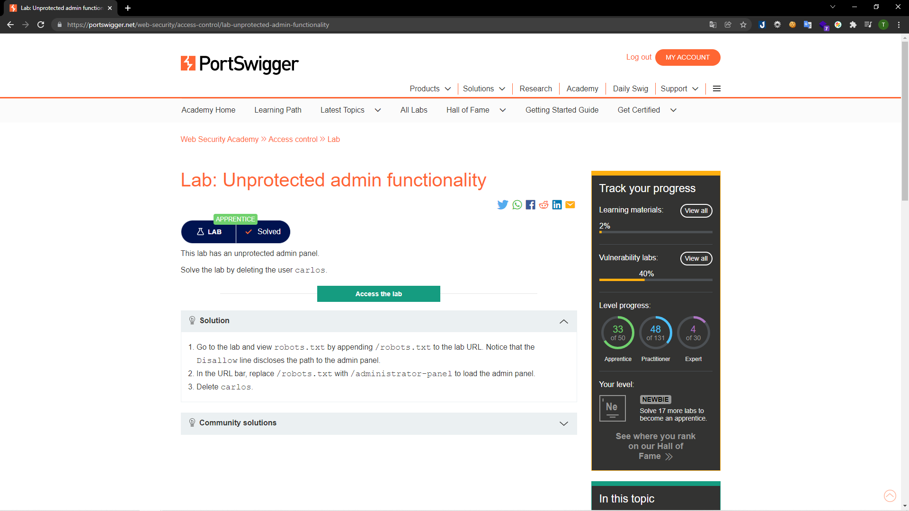
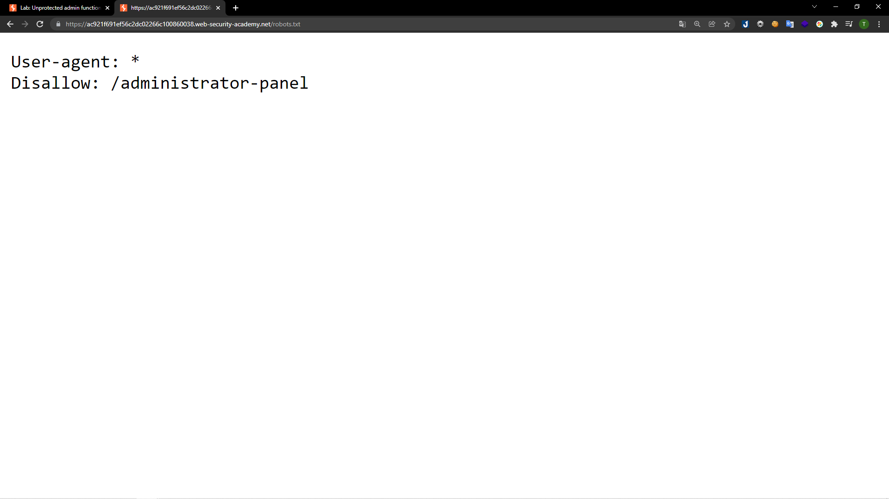
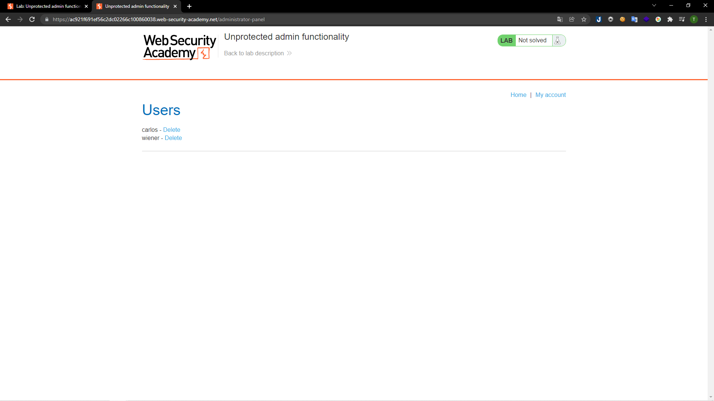
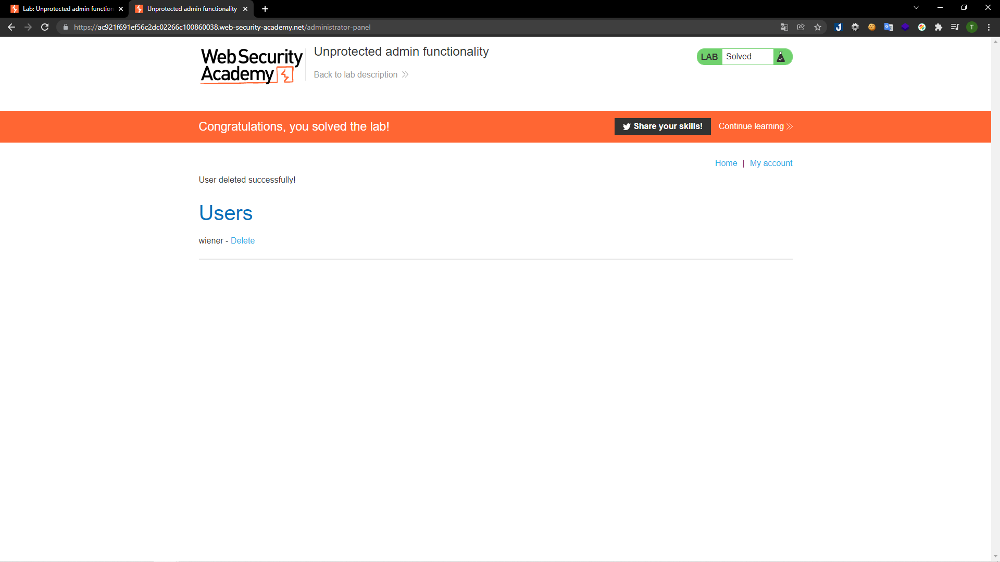

# [Lab: Unprotected admin functionality](https://portswigger.net/web-security/access-control/lab-unprotected-admin-functionality)

## Yêu cầu:

Xóa tài khoản user `carlos`

---

Ở lab này chức năng của người quản trị không được bảo vệ và để lộ ở đường dẫn `/robots.txt` :

Truy cập vào đường dẫn `/administrator-panel` để vào trang quản lý của admin:

Xóa tài khoản của người dùng `carlos`:

