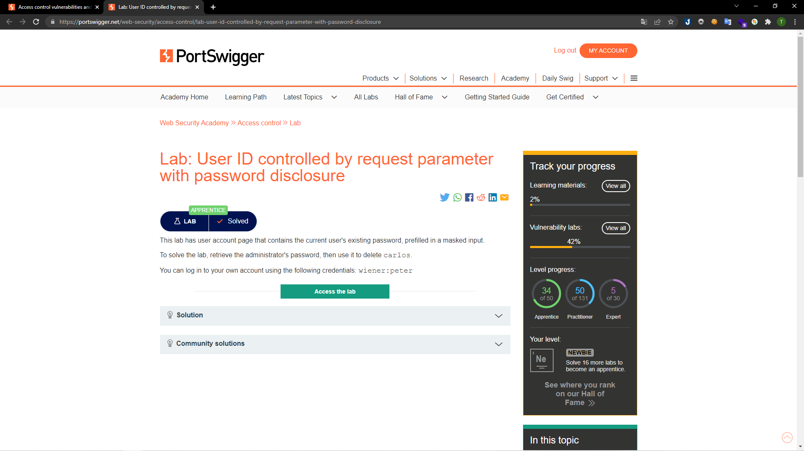
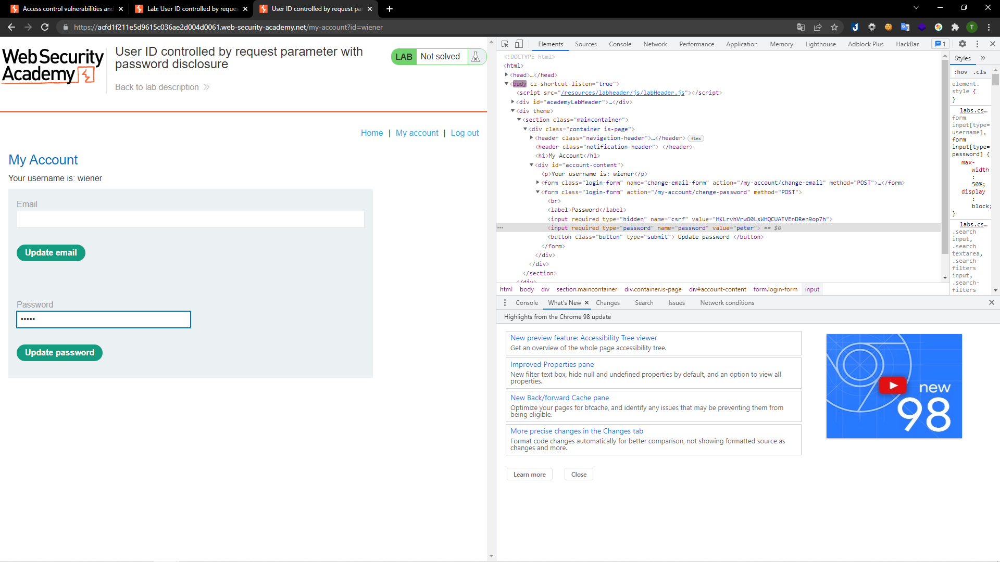
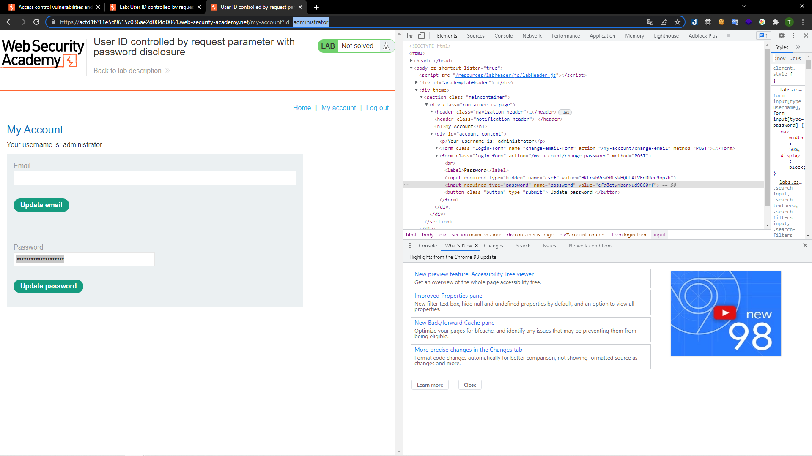
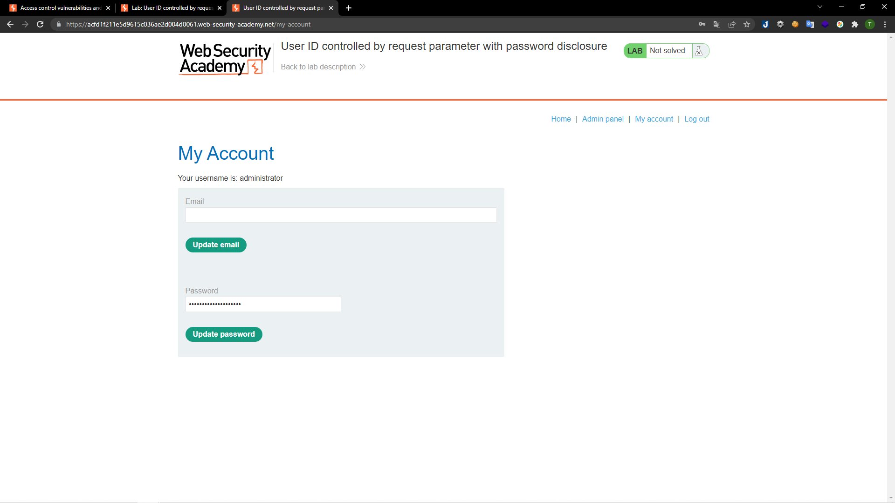
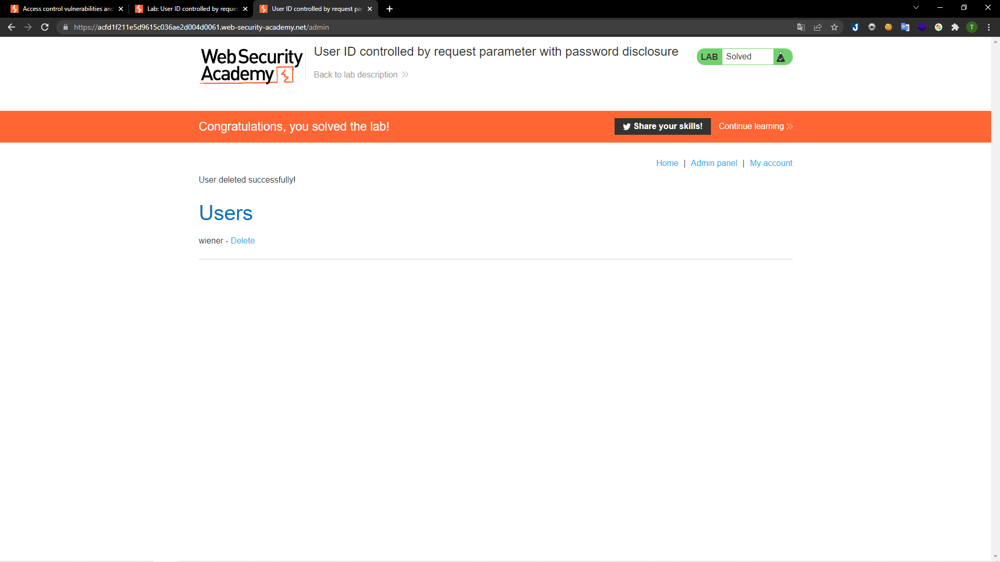

# [Lab: User ID controlled by request parameter with password disclosure](https://portswigger.net/web-security/access-control/lab-user-id-controlled-by-request-parameter-with-password-disclosure)

## Yêu cầu:

Lab này có một trang tài khoản có chứa mật khẩu của người dùng hiện tại. Hãy lấy tài khoản của `administrator` sau đó xóa tài khoản của người dùng carlos. Có thể sửa dụng tài khoản được cho sẵn `wiener:peter`

---

Trước hết mình đăng nhập bằng tài khoản được cấp, sau đó check source code thì đã nhìn thấy mật khẩu bị ẩn của người dùng:

Mình thay đổi param `user` được truyền vào ở URL thành `administrator` sau đó check source code thì đã thấy được mật khẩu của tài khoản `administrator`:

Sử dụng tài khoản `administrator` với password được tìm thấy để đăng nhập:

Sau đó vào `Admin panel` là có thể xóa được tài khoản của người dùng `carlos`:

