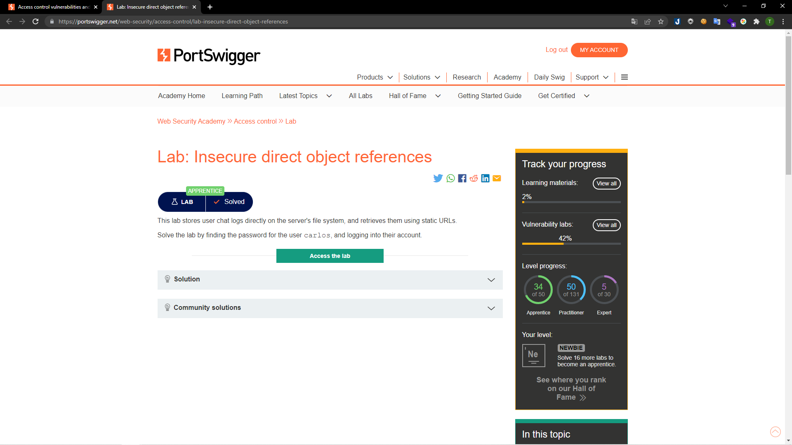
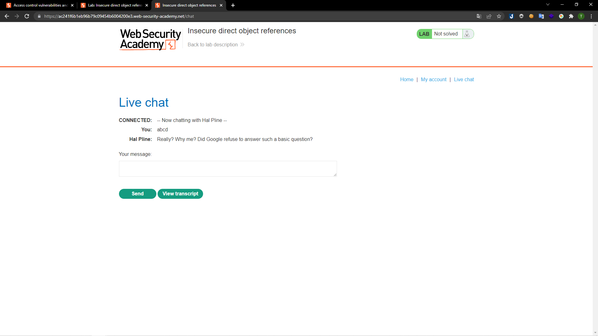
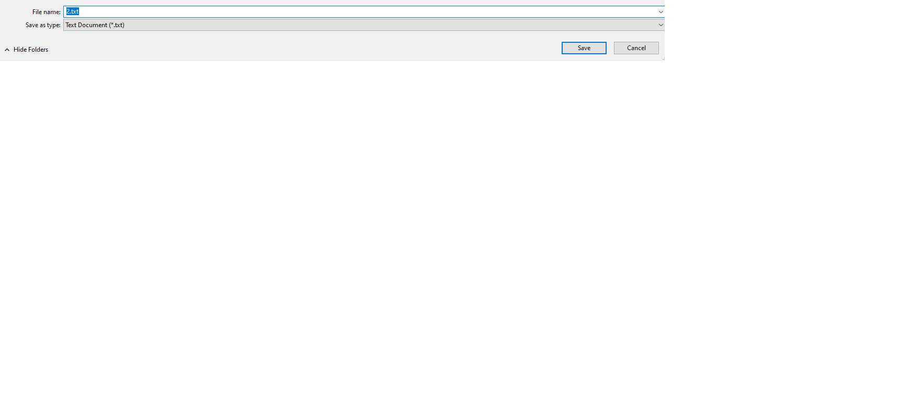
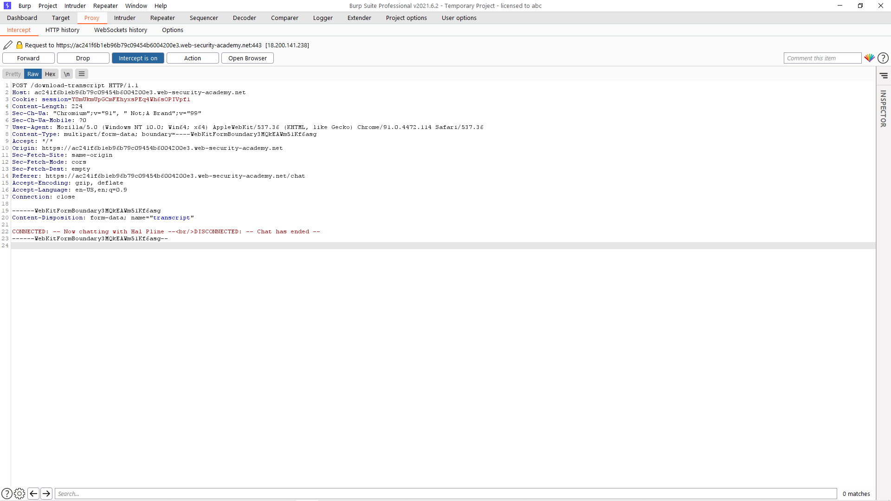
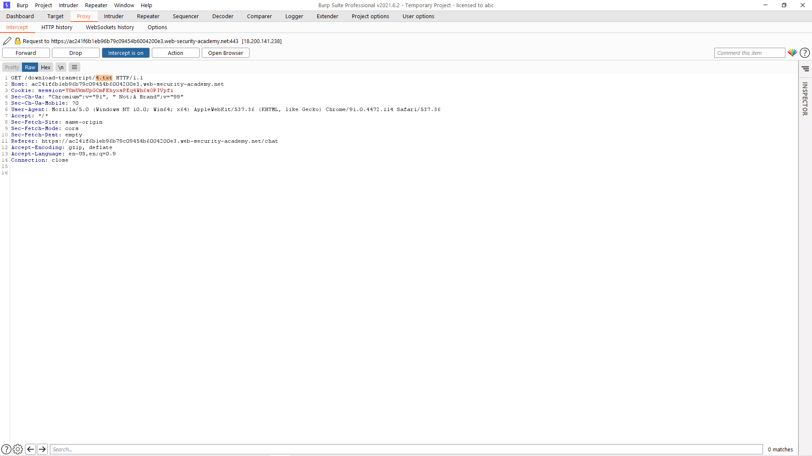
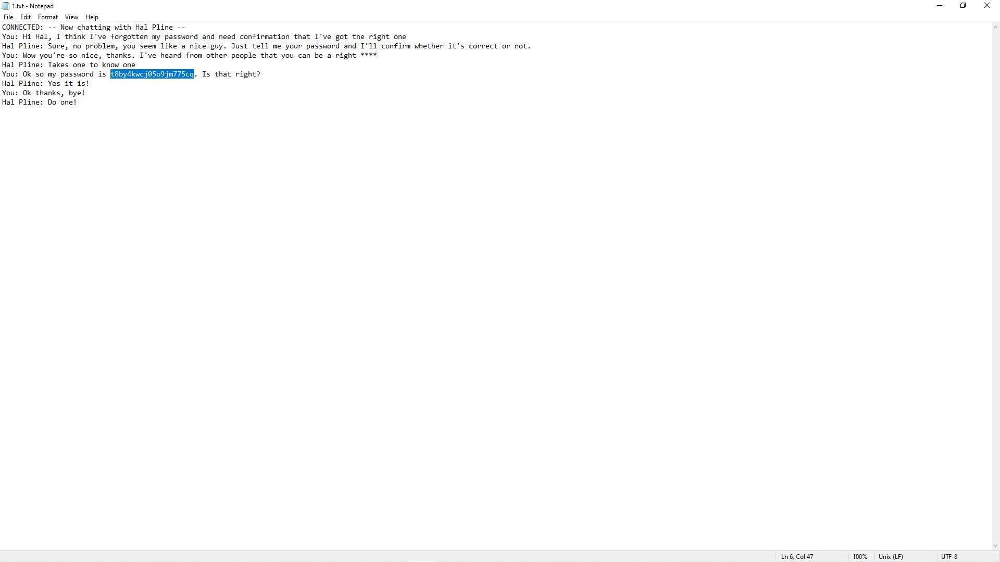
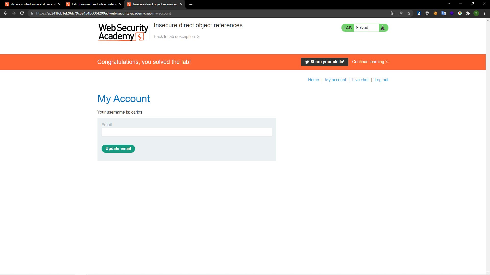

# [Lab: Insecure direct object references](https://portswigger.net/web-security/access-control/lab-insecure-direct-object-references)

## Yêu cầu:

Lab này lưu trữ lịch sử chat ở file hệ thống của server và để lộ ở URLs. Bằng cách đó hãy tìm mật khẩu của người dùng `carlos`.

---

Trước hết mình đăng nhập và chat thử một từ bất kì:

Sau đó mình sẽ xem thử script, lúc này server sẽ tải về 1 file. Nhưng điểm lạ là file này bắt đầu từ 2 chứ không phải 1:

Mình bắt request của việc down script:

Sau đó sửa tất cả các request download từ `4.txt` thành `1.txt` để có thể tải được file đầu tiên của hệ thống:

Trong file này có chứa mật khẩu mình cần tìm:

Chỉ cần dùng username `carlos` đăng nhập là mình hoàn thành được lab:

