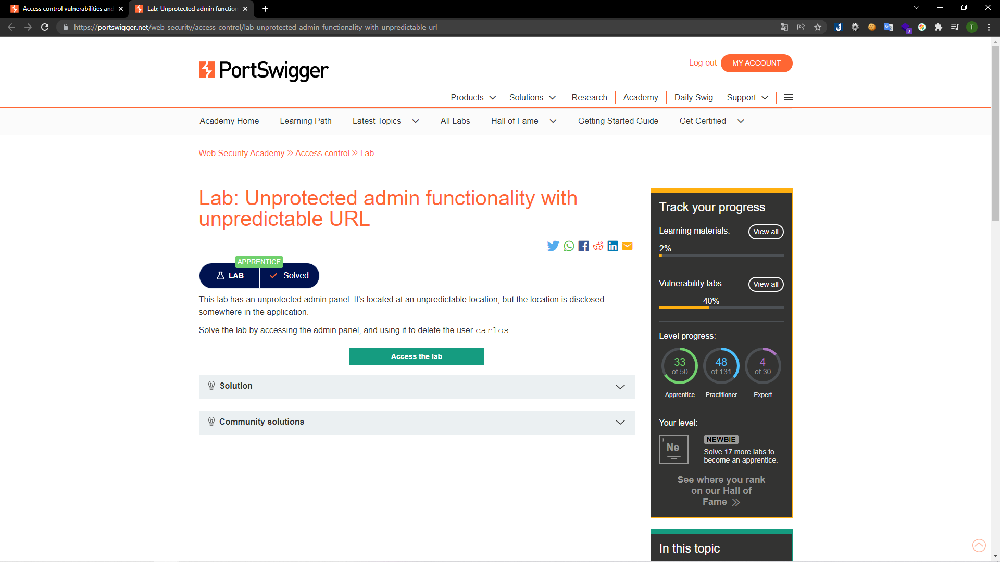
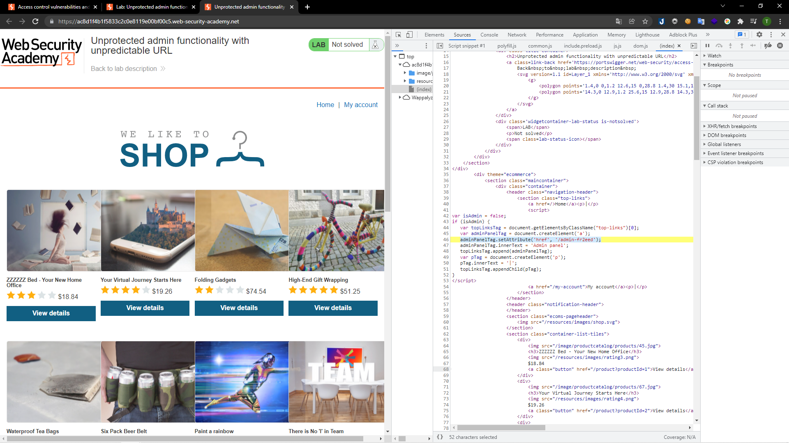
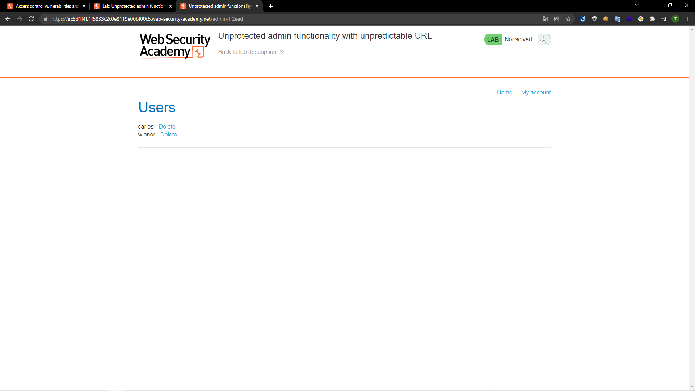
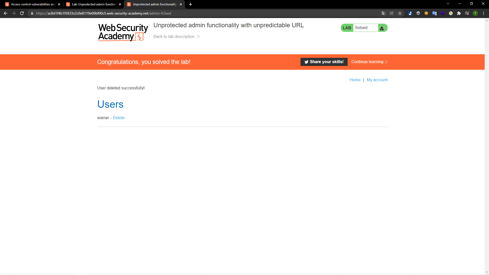

# [Lab: Unprotected admin functionality with unpredictable URL](https://portswigger.net/web-security/access-control/lab-unprotected-admin-functionality-with-unpredictable-url)

## Yêu cầu:

Truy cập vào trang của admin và xóa tài khoản `carlos`

---

Mình đọc qua source code của trang chủ và nhận thấy có một hàm với điều kiện `if(isAdmin)` có để lộ một đường dẫn:

Mình truy cập vào đường dẫn `/admin-fr2eed` thì có thể vào được trang quản trị của admin:

Sau đó chỉ cần xóa tài khoản của người dùng carlos là có thể hoàn thành lab:

