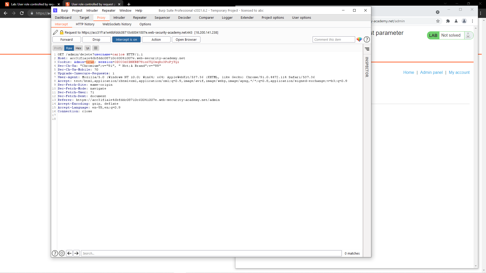

# [Lab: User role controlled by request parameter](https://portswigger.net/web-security/access-control/lab-user-role-controlled-by-request-parameter)

## Yêu cầu:

Sử dụng tài khoản `wiener:peter` truy cập vào `/admin` để xóa tài khoản của người dùng `carlos`:

---

Đây là một lab khai thác access control dựa theo tham số truyền vào.

Mình sử dụng tài khoản được cấp truy cập vào trang `/admin` thì nhận được thông báo lỗi:

Mình sử dụng BurpSuite để bắt request này thì nhận thấy cookie có dữ liệu `Admin=false`:

Sửa lại để `Admin=true` ở tất cả các request sau đó forward thì mình vào được trang admin:

Tiếp dục dùng BurpSuite để bắt request khi xóa tài khoản và sửa `Admin=true`:

Sau đó forward các request là có thể hoàn thành:

