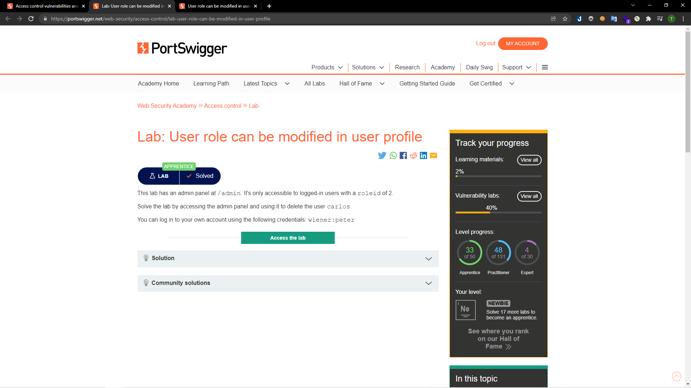
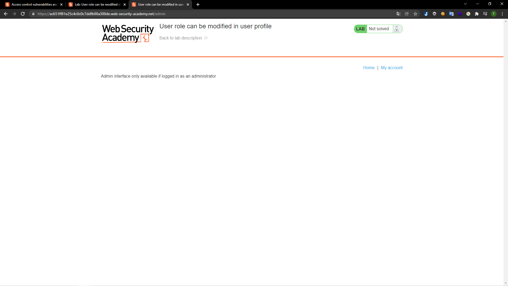
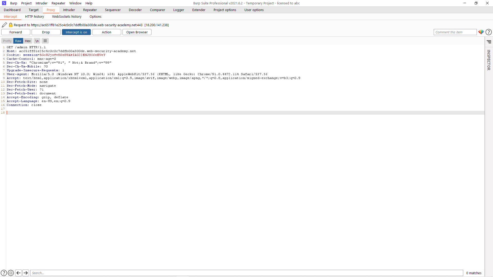
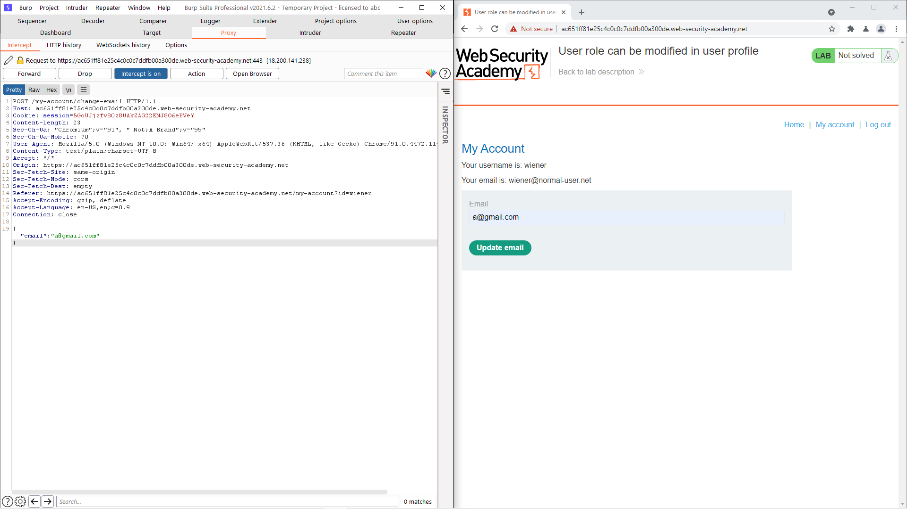
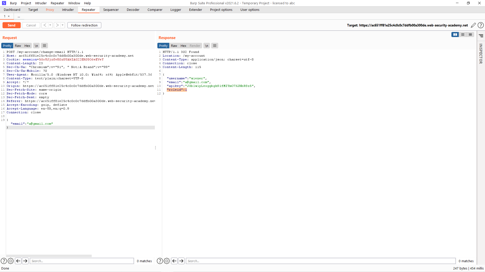
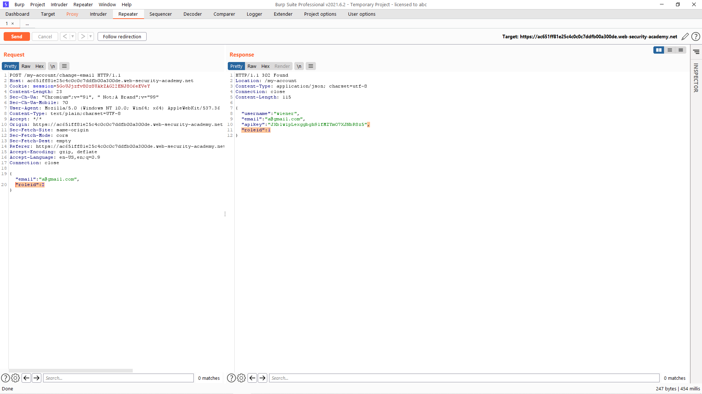
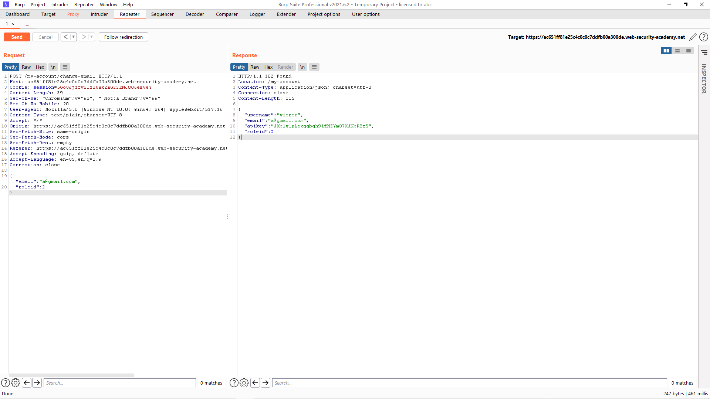
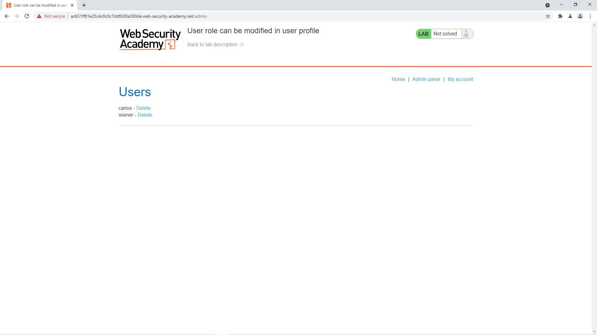
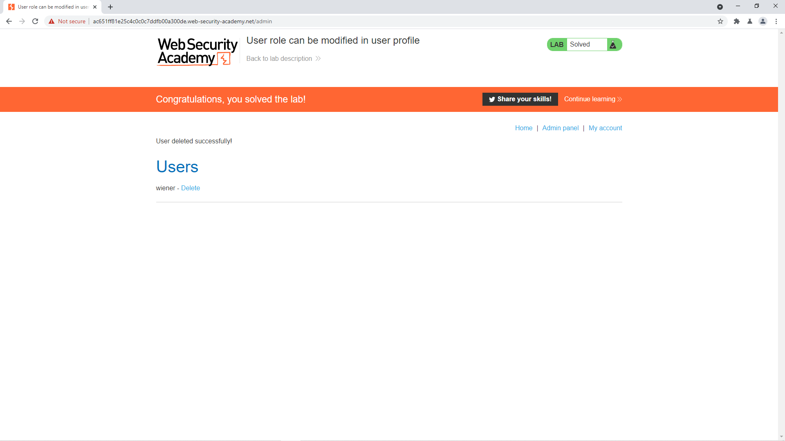

# [Lab: User role can be modified in user profile](https://portswigger.net/web-security/access-control/lab-user-role-can-be-modified-in-user-profile)

## Yêu cầu:

Sử dụng tài khoản `wiener:peter` truy cập vào `/admin` để xóa tài khoản của người dùng `carlos`. Cần phải thay đổi `roleid` thành 2 để thực hiện:

---

Đây là một lab khai thác access control dựa theo tham số truyền vào.

Mình đăng nhập với tài khoản được cấp, sau đó vào `/admin` tuy nhiên lại không thể truy cập:

Mình cũng thử bắt request này bằng BurpSuite tuy nhiên cũng không có điều gì đặc biệt:

Mình sử dụng tính năng update mail khi mới đăng nhập tài khoản để xem thông tin:

Mình send to repeater để xem phản hồi của request này thì thấy server trả về 1 json có thông tin của `roleid`:

Mình đã thay đổi giá trị của `roleid` trong request gửi lên server thành 2:

Sau đó `Send` lên server thì `roleid` của mình đã được cập nhật thành 2:

Bây giờ mình quay lại trang web là đã truy cập được vào `/admin`:

Xóa tài khoản là hoàn thành lab:

