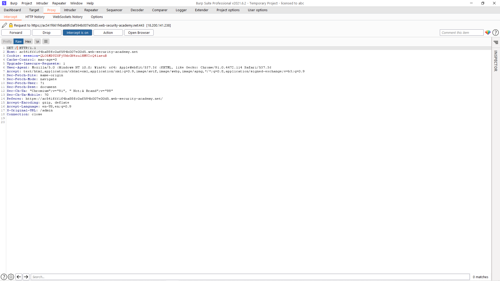

# [Lab: URL-based access control can be circumvented](https://portswigger.net/web-security/access-control/lab-url-based-access-control-can-be-circumvented)

## Yêu cầu:

Trang quản lý admin `/admin` không cần xác thực người dùng, tuy nhiên hệ thống Front-end được cấu hình để chặn truy cập tới đường dẫn. Dùng header `X-Original-URL` để truy cập.

---

Lab này sẽ được solve dựa theo việc sử dụng lỗ hổng của bên server. Cụ thể ở đây là việc ghi đè URL qua header `X-Original-URL`.

Trước hết mình thử vào trực tiếp đường dẫn `/admin` thì nhận được thông báo `access denied`

Mình bắt request này bằng BurpSuite:

Để kiểm tra header `X-Original-URL` có hoạt động hay không mình sẽ thêm header này với một giá trị bất kì. Tuy nhiên cần xóa hoặc đổi `admin` ở request line thành một giá trị khác, ở đây mình sẽ xóa `admin`:

Mình send lên server và nhận được phản hồi mình mong muốn:

Mình gửi response tới trình duyệt và thử xóa:

Tuy nhiên lại có thông báo `Access denied`:

Do vậy mình sẽ không thể xóa trực tiếp được. Tuy nhiên nhờ có việc này mình tìm được đường dẫn xóa tài khoản `/admin/delete?username=carlos`. Mình sẽ sử dụng nó và chỉnh sửa ở phần request bằng các thêm header `X-Original-URL`. Header này chỉ ghi đề đường dẫn chứ không ghi đè param, nên param vẫn sẽ để nguyên ở request line:

Forward và sửa ở yêu cầu tiếp theo:

Và mình hoàn thành lab:

