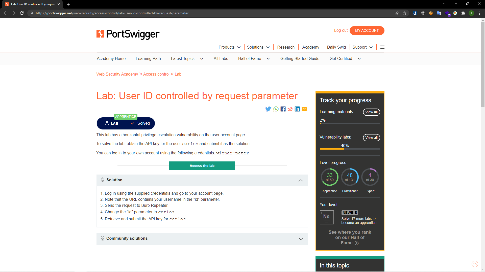
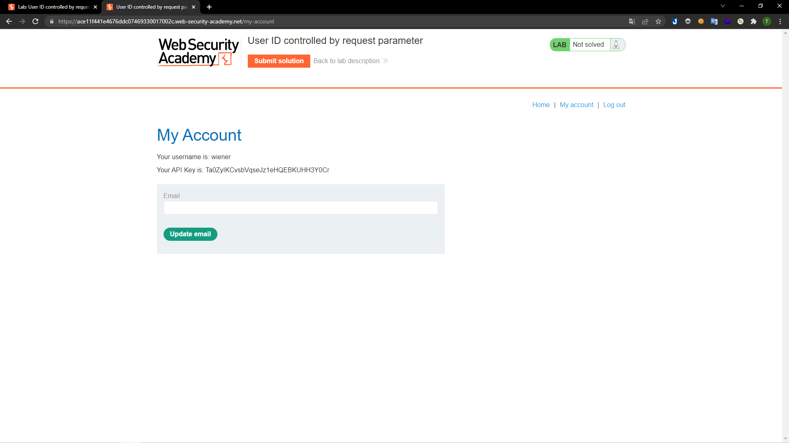
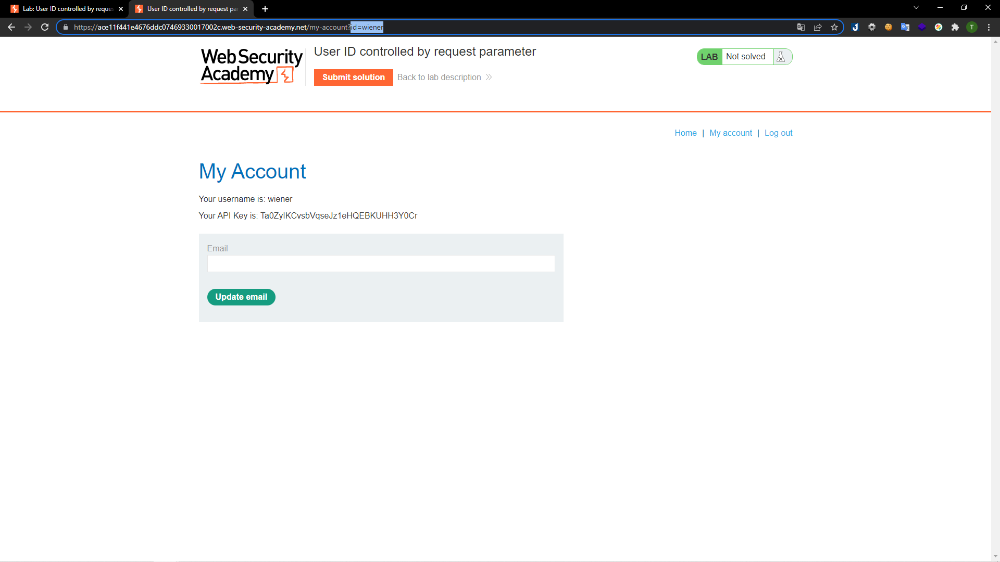
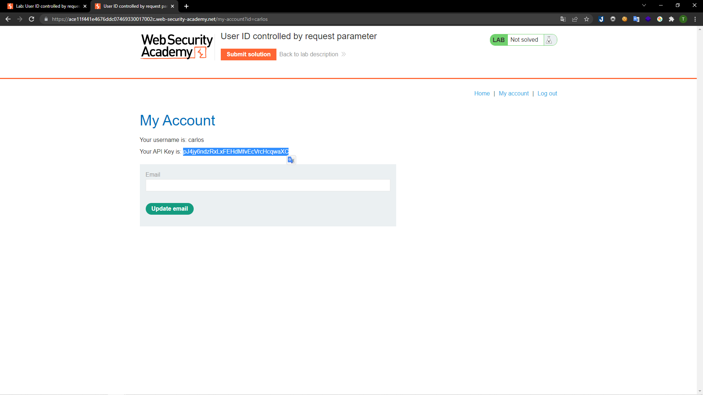
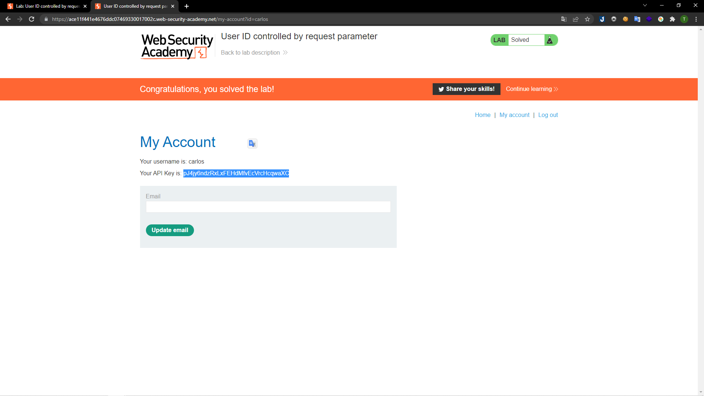

# [Lab: User ID controlled by request parameter](https://portswigger.net/web-security/access-control/lab-user-id-controlled-by-request-parameter)

## Yêu cầu:

Sử dụng tài khoản `wiener:peter` để lấy API key của người dùng carlos

---

Ở bài này sẽ sử dụng lỗ hổng kiểm soát truy cập theo chiều ngang để tấn công. Trước hết mình đăng nhập với tài khoản `wiener:peter` và nhận được API của tài khoản `wiener`:

Khi reload lại trang web thì sẽ lộ ra một param `user` có giá trị là tên người dùng hiện tại:

Sau đó đổi giá trị của `user` thành `carlos` là lấy được API của `carlos`:

Lấy API nhận được và submit là có thể solve được:

