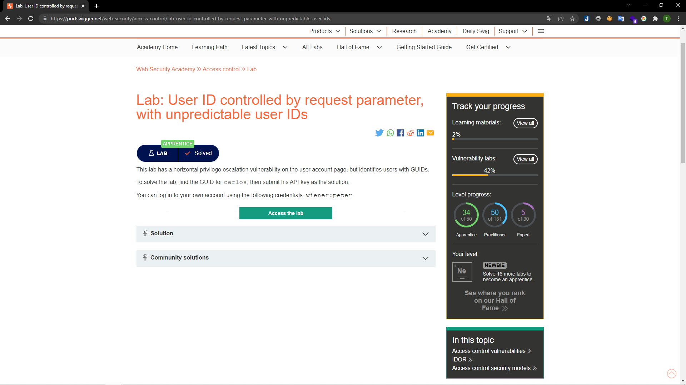
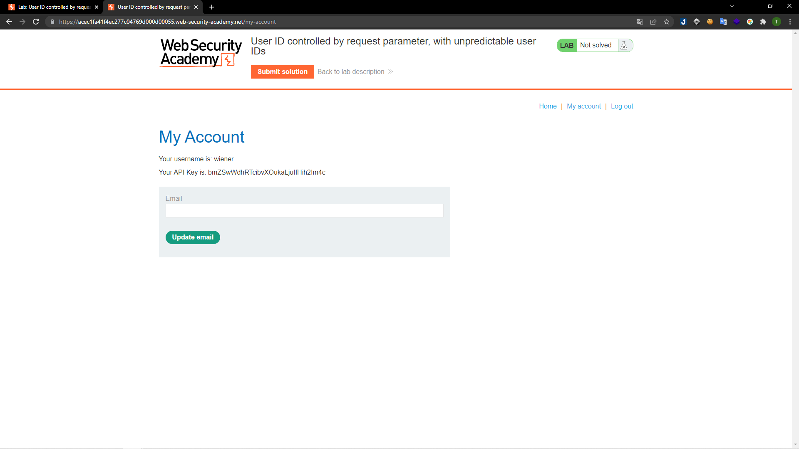
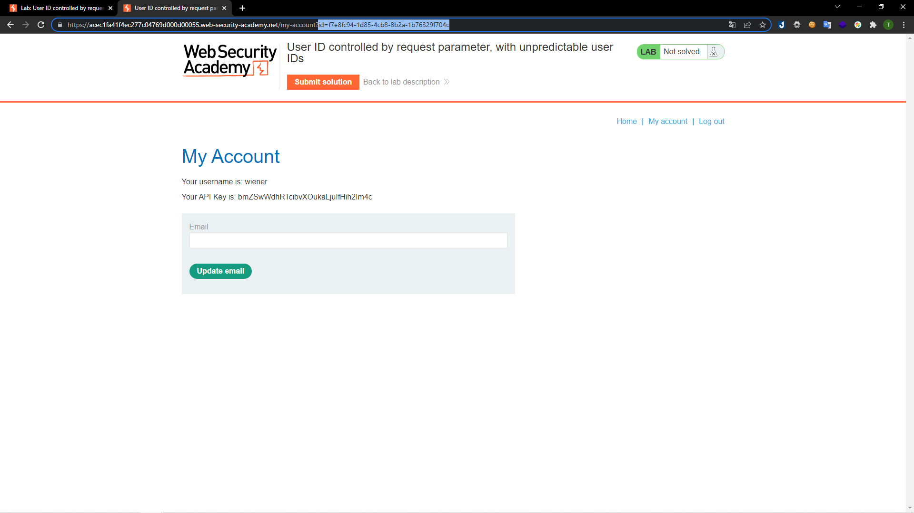
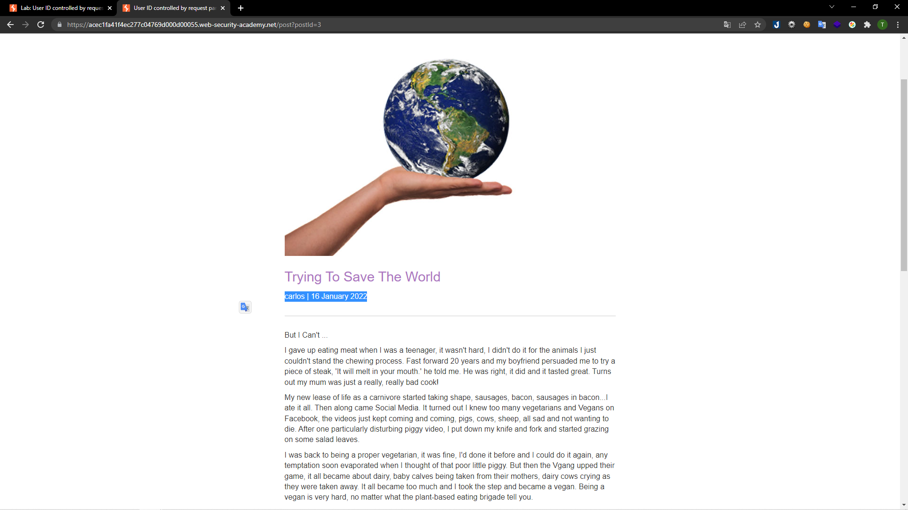
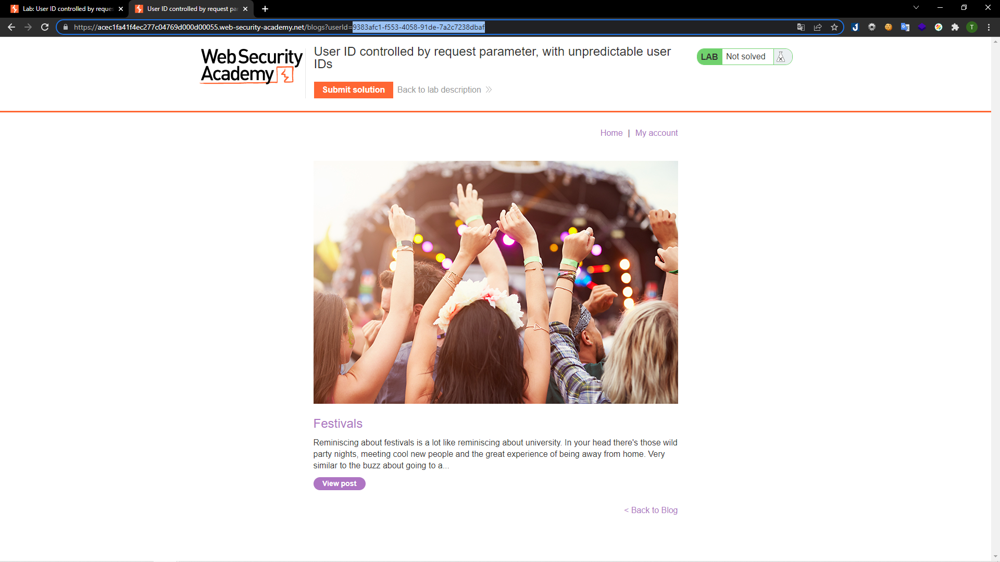
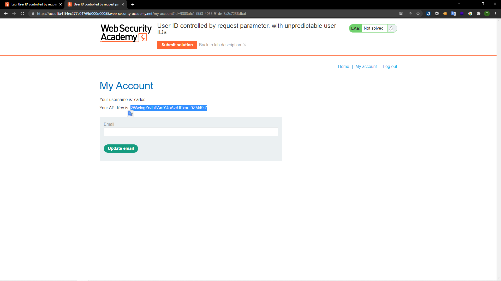
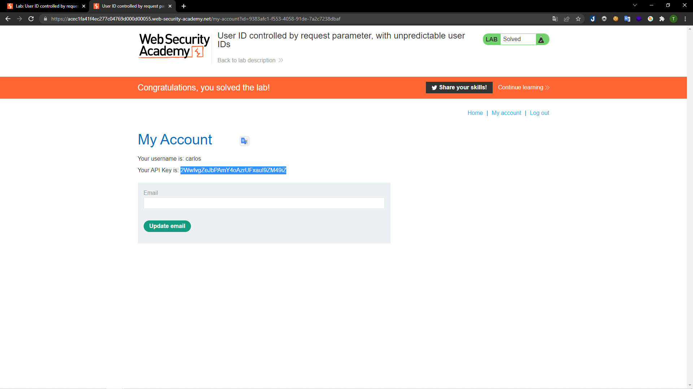

# [Lab: User ID controlled by request parameter, with unpredictable user IDs](https://portswigger.net/web-security/access-control/lab-user-id-controlled-by-request-parameter-with-unpredictable-user-ids)

## Yêu cầu:

Lab có chứa một lỗ hổng kiểm soát truy cập theo chiều ngang tuy nhiên người dùng được định danh bằng GUIDs. Cần tìm GUIDs của người dùng carlos để lấy API key. Có thể dùng tài khoản `wiener:peter`

---

Trước hết mình đăng nhập với tài khoản được cấp:

Click lại vào phần `myaccount` thì mình nhận được GUIDs của người dùng `wiener`:

Bây giờ việc cần làm là tìm GUIDs của người dùng `carlos` sau đó thay vào phần id param là có thể lấy được API key.
Quay trờ lại với trnag `Home`, trong các post mình tìm được một post của người dùng `carlos`:

Khi bấm vào đường dẫn thì trên URL có để lộ thông tin của người dùng, cụ thể là GUIDs:

Mình copy nó sau đó quay trở lại trang `Myaccount` để thay đôi giá trị của id param là có được API key cần tìm:

Chỉ cần submit nữa là hoàn thành:

