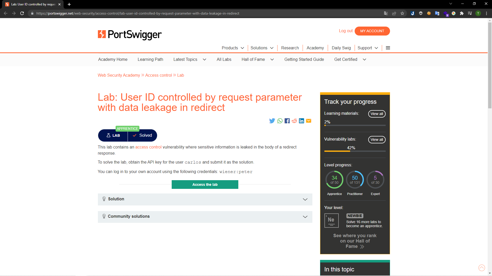
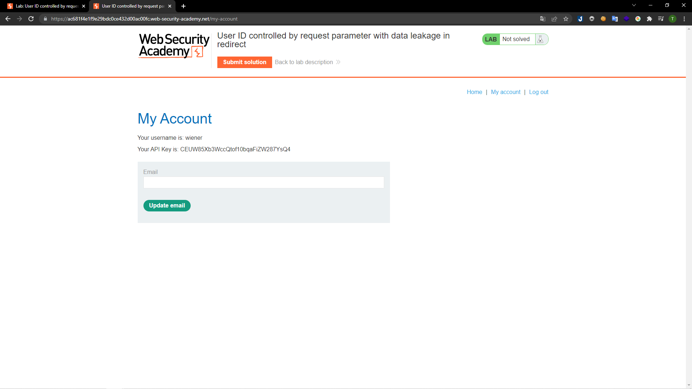
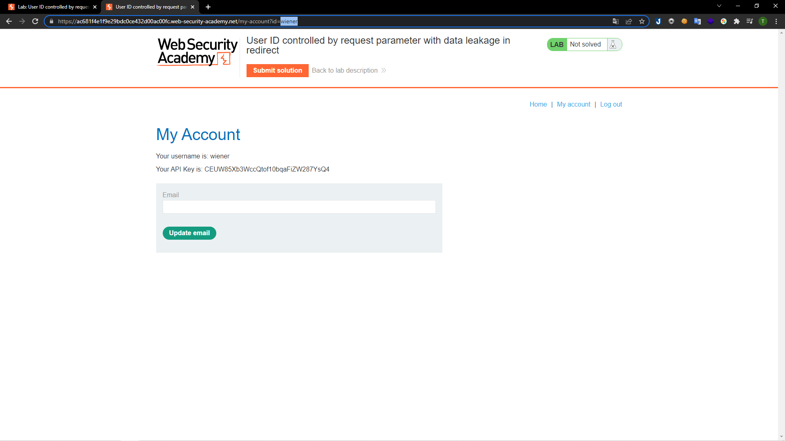
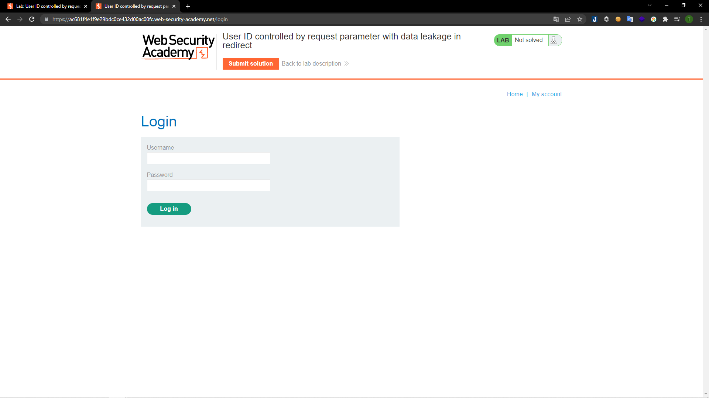
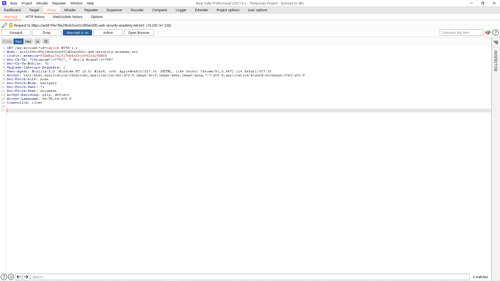
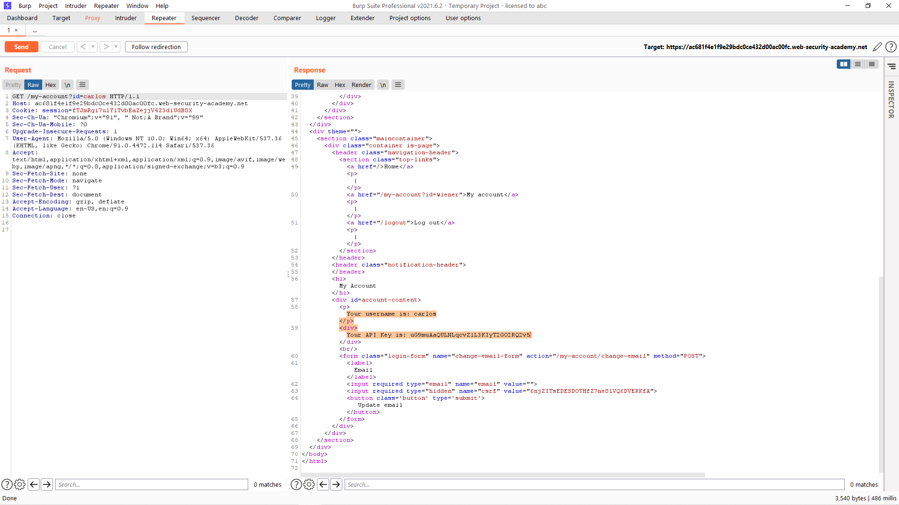
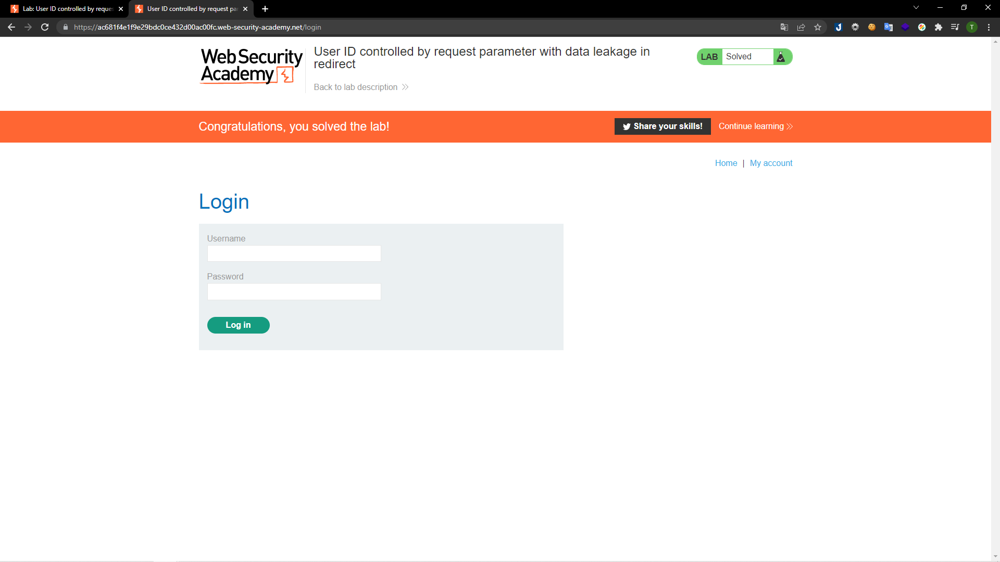

# [Lab: User ID controlled by request parameter with data leakage in redirect](https://portswigger.net/web-security/access-control/lab-user-id-controlled-by-request-parameter-with-data-leakage-in-redirect)

## Yêu cầu:

Lab có chứa lỗ hổng kiếm soát truy cập khi chuyển hướng phản hổi. Hoàn thành lab bằng cách lấy API key của người dùng `carlos` và sử dụng tài khoản `wiener:peter`

---

Trước hết mình đăng nhập với tài khoản được cấp thì nhận được API key của người dùng `wiener`

Sau đó mình vào `My account` để URL hiển thị đầy đủ các param cần thiết:

Mình thay đổi giá trị `wiener` thành `carlos`, tuy nhiên mình đã bị logout khỏi trang web => ở đây có sự chuyển hướng:

Mình bắt request để xem yêu cầu chuyển hướng này bằng BurpSuite:

Mình `Send to Repeater` sau đó `Send` để xem phản hổi trước khi bị chuyển hướng, và mình đã có được API key của người dùng `carlos`:

Submit API key là hoàn thành:

