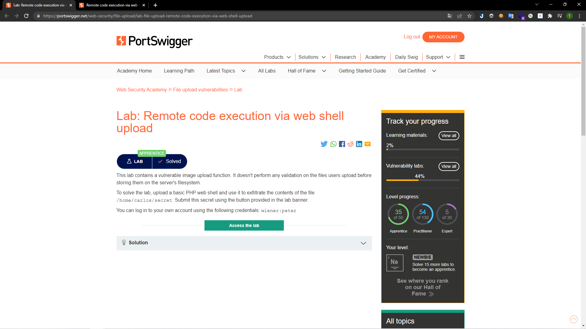
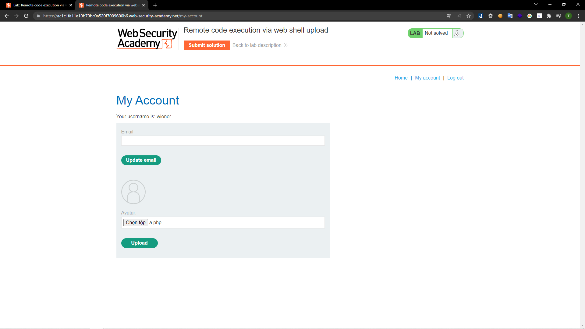
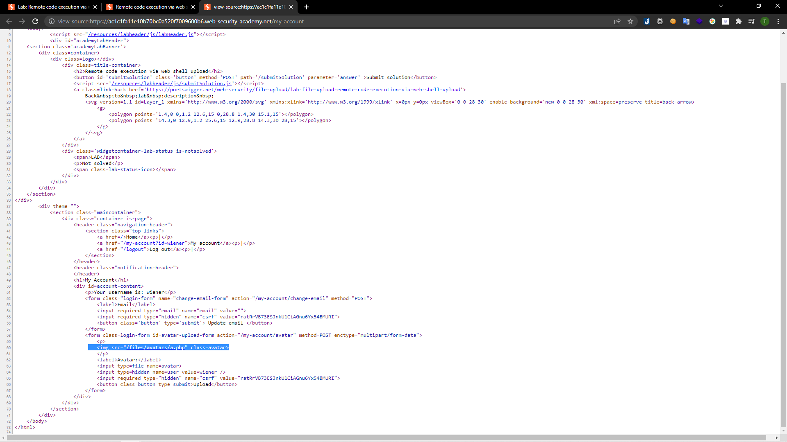
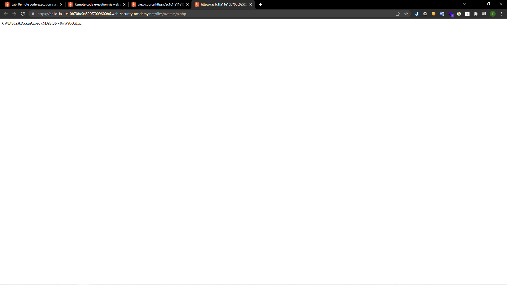
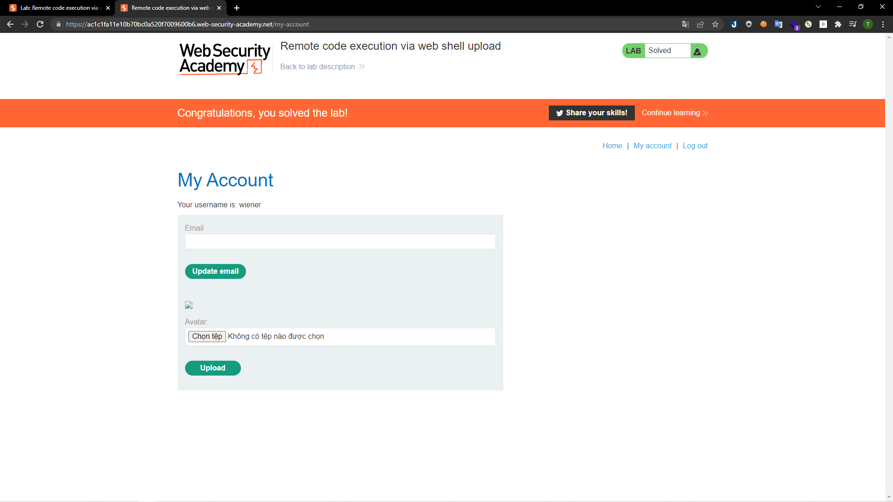

# [Lab: Remote code execution via web shell upload](https://portswigger.net/web-security/file-upload/lab-file-upload-remote-code-execution-via-web-shell-upload)

## Yêu cầu:

Chức năng tải ảnh lên không xác thực dữ liệu người dùng tải lên. Sử dụng PHP shell để lấy tên các file trong thư mục /home/carlos/secret. Có thể sử dụng tài khoản wiener:peter

---

Tạo file `a.php` có nội dung lấy thông tin của đường dẫn:

`<?php echo file_get_contents('/home/carlos/secret'); ?>`

Tại phần tải ảnh lên. Mình lựa chọn upload file php vừa rồi:

Sau đó file đã được tải lên thành công. Để load được file vừa tải lên, mình kiểm tra source code và tìm được đường dẫn của file tải lên:

Truy cập vào đường dẫn mình lấy được đoạn mã để submit:

Submit là mình có thể hoàn thành được bài lab:

