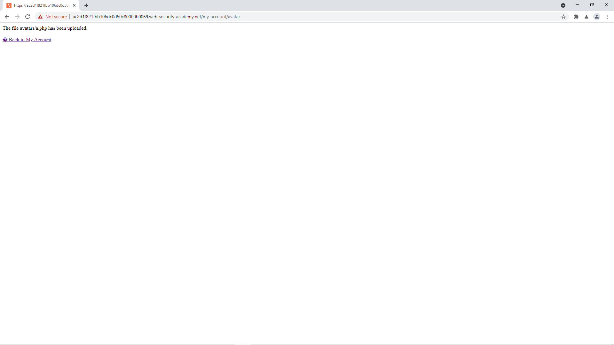

# [Lab: Web shell upload via Content-Type restriction bypass](https://portswigger.net/web-security/file-upload/lab-file-upload-web-shell-upload-via-content-type-restriction-bypass)

## Yêu cầu:

Chức năng tải ảnh lên không xác thực dữ liệu người dùng tải lên. Sử dụng PHP shell để lấy tên các file trong thư mục /home/carlos/secret. Có thể sử dụng tài khoản wiener:peter

---

Nếu thực hiện tương tự giống như [Lab1](../Lab1/) thì sẽ nhận được thông báo lỗi chỉ nhận file image/jpeg:

Mình kiểm tra lại request upload file PHP gửi lên thì thấy được content-type không phù hợp:

Mình chỉnh sửa lại content-type cho phù hợp sau đó upload lại:

Kiểm tra lại source code sau khi upload thì tìm được đường dẫn của file php vừa rồi:

Mình lấy được dãy số cần để submit:

Và hoàn thành được lab:

