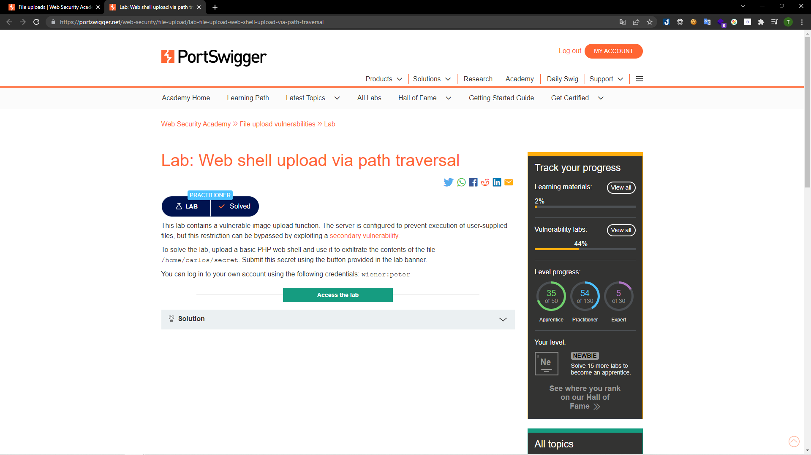
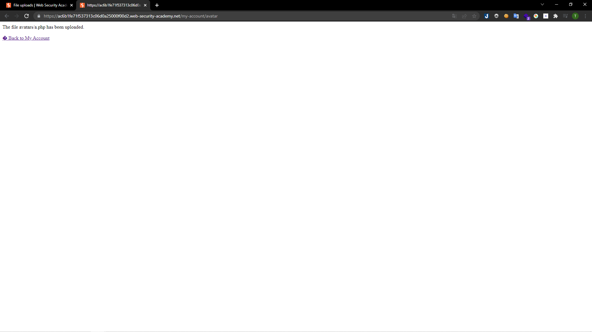
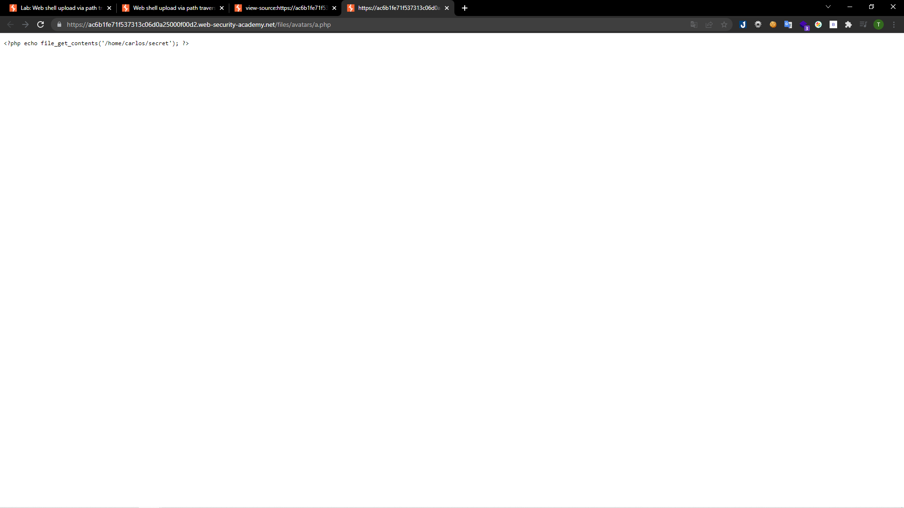
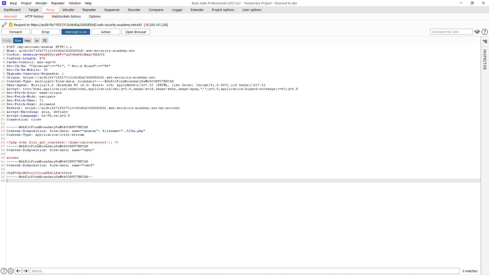
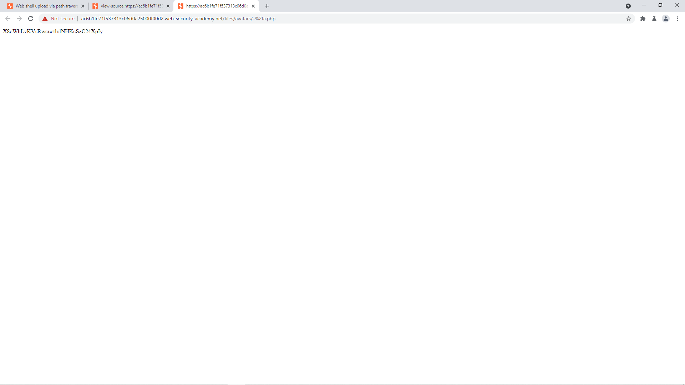
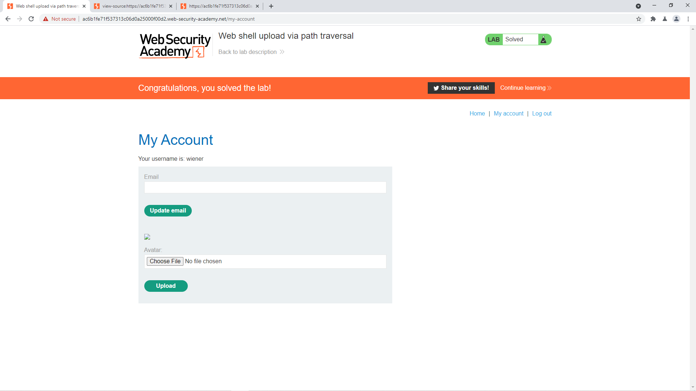

# [Lab: Web shell upload via path traversal](https://portswigger.net/web-security/file-upload/lab-file-upload-web-shell-upload-via-path-traversal)

## Yêu cầu:

Bài lab có lỗi trong chức năng tải ảnh lên. Máy chủ được cấu hình để ngăn việc thực thi file người dùng tải lên. Sử dụng PHP shell để lấy tên các file trong thư mục /home/carlos/secret. Có thể sử dụng tài khoản wiener:peter

---

Sau khi upload thử 1 file PHP giống như [Lab1](../Lab1) thì nhận được thông báo thành công:

Tuy nhiên sau khi mở file upload lên thì file này không được thực thi:

Folder chứa avatar đã được config để chặn thực thi file. Tuy nhiên folder cha lại không được config để làm điều đó. Vì vậy mình bắt request gửi file lên sau đó chỉnh sửa file để trỏ về folder cha của folder avatar:

Sau khi upload thành công mình mở file và nhận được đoạn mã cần:

Và hoàn thành được lab:

