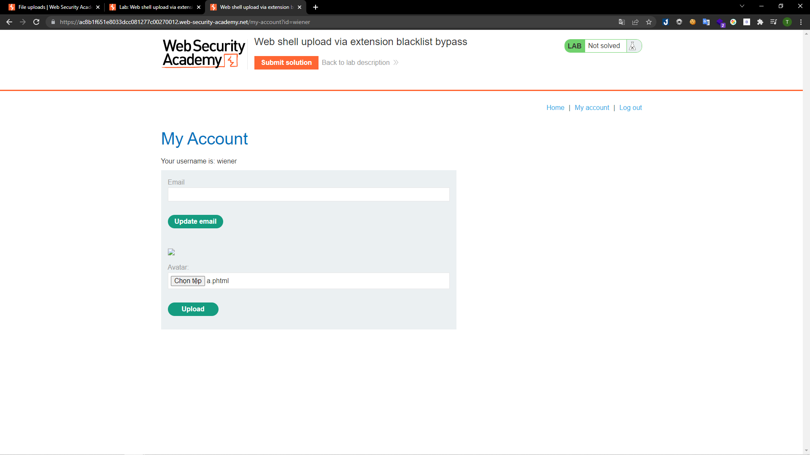
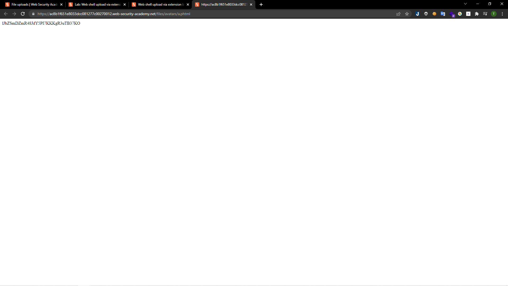
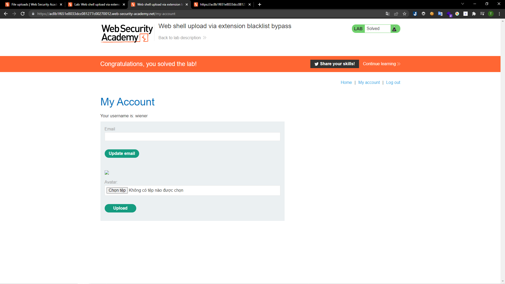

# [Lab: Web shell upload via extension blacklist bypass](https://portswigger.net/web-security/file-upload/lab-file-upload-web-shell-upload-via-extension-blacklist-bypass)

## Yêu cầu:
Chức năng tải ảnh lên chứa lỗ hổng file upload. Một số phần mở rộng tệp nhất định được đưa vào black list, nhưng biện pháp bảo vệ này có thể bị bỏ qua do một lỗ hổng cơ bản trong cấu hình của blacklist.

Có thể dùng tài khoản `wiener:peter` để tải lên mã PHP đọc nội dung của file `/home/carlos/secret`

---
Ở lab này cấu hình của apache2.conf không cho chúng ta thực thi trực tiếp file php. Tuy nhiên đuôi file thành `.phtml` hoàn toàn có thể thực thi, mình thay file `a.php` của [Lab1](../Lab1/) thành `a.phtml` và upload là có thể lấy được đoạn mã để submit:

Và mình hoàn thành bài lab:

