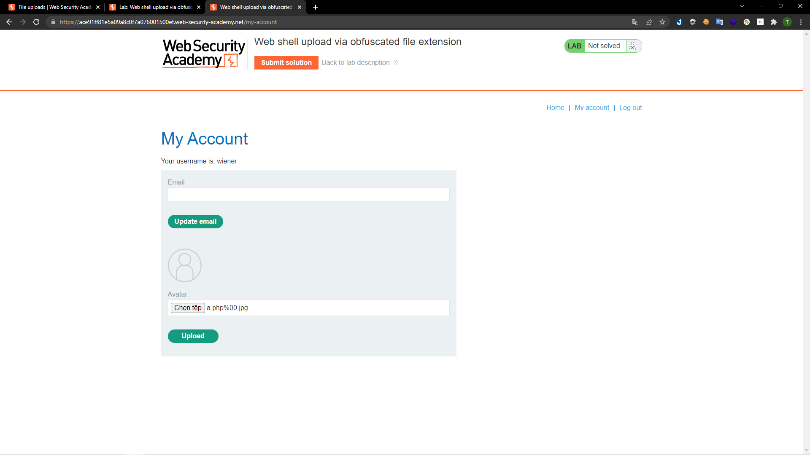
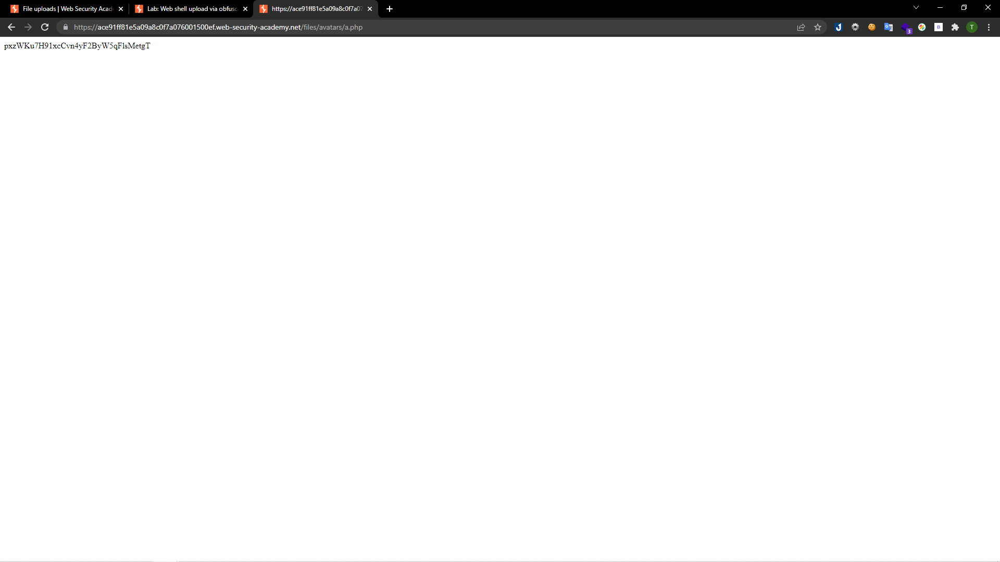
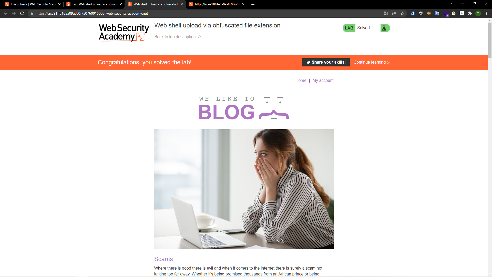

# [Lab: Web shell upload via obfuscated file extension](https://portswigger.net/web-security/file-upload/lab-file-upload-web-shell-upload-via-obfuscated-file-extension)
## Yêu cầu:
Chức năng tải ảnh lên chứa lỗ hổng file upload. Một số phần mở rộng tệp nhất định được đưa vào black list, nhưng biện pháp bảo vệ này có thể bị bỏ qua do một lỗ hổng cơ bản trong cấu hình của blacklist.

Có thể dùng tài khoản `wiener:peter` để tải lên mã PHP đọc nội dung của file `/home/carlos/secret`

---
Ở lab này sử dụng blacklist để chặn phần mở rộng `.php` và chỉ cho phép tải lên tệp `.jpeg` hoặc `.png`. Tuy nhiên có thể vượt qua lớp bảo mật này bằng cách sử dụng NULL byte `%00`. Mình chỉ cần thay phần mở rộng của file `a.php` ở [Lab1](../Lab1/) rồi upload lên:

Truy cập vào file vừa tải lên:

Submit mã nhận được là hoàn thành được Lab:

