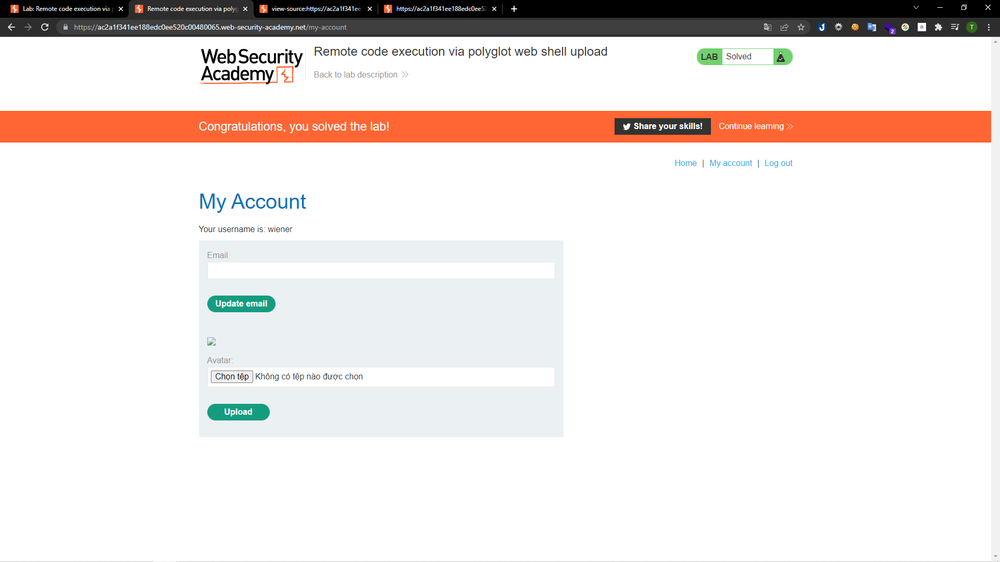

# [Lab: Remote code execution via polyglot web shell upload](https://portswigger.net/web-security/file-upload/lab-file-upload-remote-code-execution-via-polyglot-web-shell-upload)
## Yêu cầu:
Lab này sẽ sử dụng nội dung của file để xác minh đó có phải là hình ảnh hay không. Có thể dùng tài khoản `wiener:peter` để tải lên mã PHP đọc nội dung của file `/home/carlos/secret`

---

Ở lab này cần tạo một file ảnh có nội dung của file PHP ở bên trong. Vì lab chỉ check theo nội dung của file nên có thể để file upload là `.php`:
Cần chuẩn bị một ảnh `a.png` sau đó sử dụng `exiftool` để tiến hành chèn đoạn code php vào phần comment bằng lệnh: 
`exiftool -Comment="<?php echo 'START ' . file_get_contents('/home/carlos/secret') . ' END'; ?>" a.png -o b.php`.

Sau khi tạo được file php mới chỉ cần upload lên:

Truy cập vào đường dẫn, đoạn mã sẽ được hiển thị giữa phần START và END:

Submit là có thể hoàn thành:

