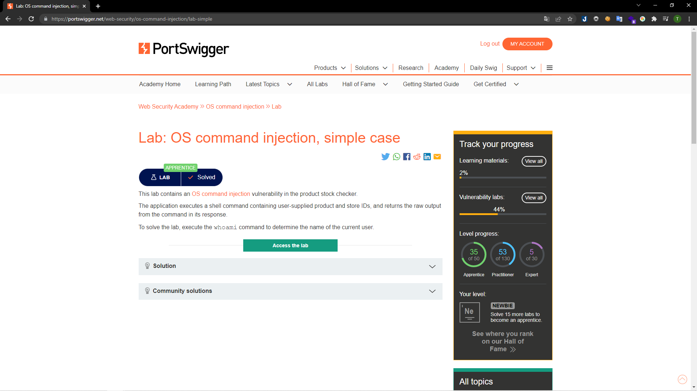

# [Lab: OS command injection, simple case](https://portswigger.net/web-security/os-command-injection/lab-simple)

## Yêu cầu:

Ứng dụng thực thi câu lệnh shell bao gồm sẩn phẩm và IDs và trả về kết quả sau khi thực hiện. Thực hiện câu lệnh `whoami` để tìm tên người dùng hiện tại.

---

Ứng dụng này là một trong bán hàng, khi vào một sản phẩm bất kì, ở phần cuối sẽ có phần check stock. Nút này sẽ thực hiện một function mà theo như đề bài nói là sử dụng shell để in ra số lượng sản phẩm còn lại:

Mình bắt request của chức năng này:

Để thực hiện kiểm tra tên người dùng, mình sử dụng phép toán PIPE (output câu lệnh trước là input câu lệnh sau) để nối thêm câu lệnh `whoami` ở cuối:

Response gửi về cho mình thông tin cần:

