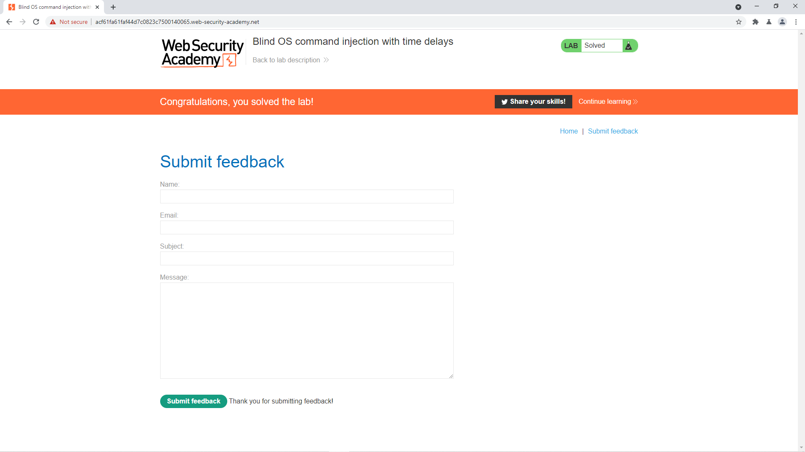

# [Blind OS Command Injection (Time Delay)](https://portswigger.net/web-security/os-command-injection/lab-blind-time-delays)

## Yêu cầu:

Ứng dụng thực thi câu lệnh shell với dữ liệu người dùng cung cấp, tuy nhiên kết quả thực thi sẽ không được trả về. Sử dụng lỗ hổng OS command injection để làm cho phản hồi trễ 10s.

---

Mình sẽ vào trang feedback sau đó bắt một request với input tùy ý:

Nếu thực hiện các câu lệnh như [Lab1](../Lab1) thì sẽ không có gì khác biệt

Tuy nhiên mình chỉ sử dụng dấu PIPE để kiểm tra các input, thì nhận được một thông báo lỗi tại trường email => shell được gọi với input tại đây:

Sử dụng lệnh `Ping -c <time> <ip>` kèm toán tử OR (||) tức là nếu dữ liệu đầu không được thực hiện thì sẽ thực hiện với dữ liệu tiếp theo, kết quả respone đã bị delay:

Sau 10s thì response được gửi về:

Và mình hoàn thành được lab:

