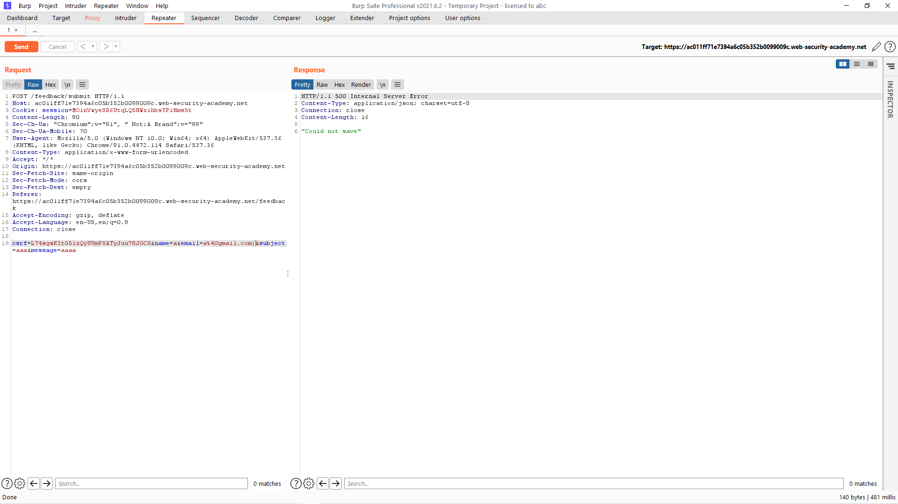

# [Lab: Blind OS command injection with output redirection](https://portswigger.net/web-security/os-command-injection/lab-blind-output-redirection)

## Yêu cầu:

Lab có chứa lỗ hổng OS command injection tại phần feedback. Ứng dụng sẽ thực hiện câu lệnh shell với input người dùng nhập vào, output sẽ không được trả về ở phần phản hồi. Tuy nhiên có thể chuyển hướng output vào thư mục: `/var/www/images/`. Ứng dụng sẽ lấy các hình ảnh tại đây. Hãy chuyển hướng đầu ra tới một tệp tại đây sau đó thông qua URL để lấy nội dung tệp. Dùng `whoami` để lấy output.

---

Giống như [Lab2](../Lab2/), mình sẽ bắt request của phần feedback với input bất kì. Sau đó thử với phép toán PIPE (|) để tìm vị trí input lỗi:

Sau đó sử dụng lệnh `whoami>/var/www/images/output.txt` để ghi output vào file txt đặt trong thử mục `images`:

Mình tìm vị trí để lấy dữ liệu từ thư mục `images`, và tìm được đó là phần tải hình ảnh của một sản phẩm:

Mình bắt request của việc xem thông tin sản phẩm, thay đổi phần filename thành tên file mình xuất ra trước đó:

Và mình hoàn thành được lab:

