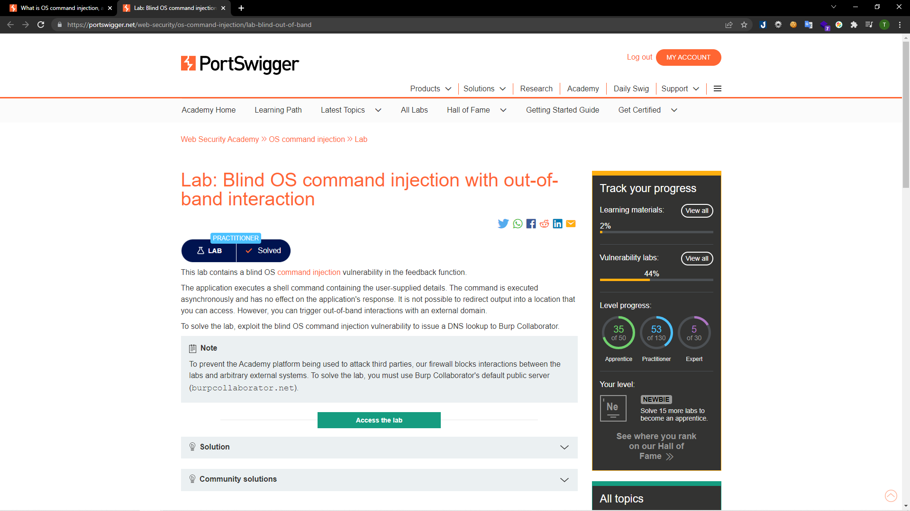

# [Lab: Blind OS command injection with out-of-band interaction](https://portswigger.net/web-security/os-command-injection/lab-blind-out-of-band)

## Yêu cầu:

Lab này chứa lỗ hổng blind OS command injection trong chức năng phản hồi.

Ứng dụng thực thi một lệnh shell chứa các chi tiết do người dùng cung cấp. Lệnh được thực thi không đồng bộ và không ảnh hưởng đến phản hồi của ứng dụng. Không thể chuyển hướng đầu ra vào một vị trí mà bạn có thể truy cập. Tuy nhiên, bạn có thể kích hoạt các tương tác ngoài băng tần với miền bên ngoài.

Để giải quyết lab, hãy khai thác lỗ hổng blind OS command injection để đưa ra bản tra cứu DNS cho Burp Collaborator.

---

Vẫn giống như [Lab3](../Lab3/) nhưng lab này đã note là nên sử dụng burp collaborator (một công nghệ cho phép Burp phát hiện ra các lỗ hổng vô hình trên máy chủ) để poll ra những request connect tới (Vì không thể thấy được lỗi được hiển thị lên nên chúng ta phải check bằng cách này).Để có thể tra cứu DNS mình sẽ sử dụng câu lệnh `nslookup`. Trước hết là bắt request của feedback:

Mình tạo một burp collaborator, sau đó copy URL của burp collaborator:

Chèn cùng với câu lệnh nslookup vào phần gmail với phép toán OR (||)

Lúc này ở collaborator sẽ xuất hiện yêu cầu từ câu lệnh nslookup mình vừa thực hiện, vậy là có thể hoàn thành lab này:

