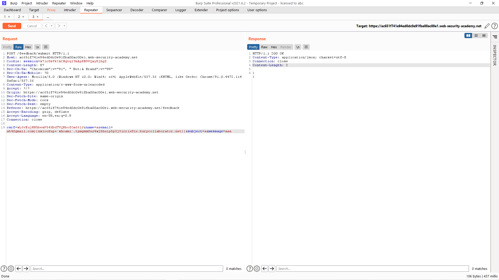

# [Lab: Blind OS command injection with out-of-band data exfiltration](https://portswigger.net/web-security/os-command-injection/lab-blind-out-of-band-data-exfiltration)

## Yêu cầu:

Lab này chứa lỗ hổng blind OS command injection trong chức năng phản hồi.

Ứng dụng thực thi một lệnh shell chứa các chi tiết do người dùng cung cấp. Lệnh được thực thi không đồng bộ và không ảnh hưởng đến phản hồi của ứng dụng. Không thể chuyển hướng đầu ra vào một vị trí mà bạn có thể truy cập. Tuy nhiên, bạn có thể kích hoạt các tương tác ngoài băng tần với miền bên ngoài.

Để giải quyết lab, hãy khai thác lỗ hổng blind OS command injection, dùng câu lệnh `whoami` để đưa ra bản tra cứu DNS cho Burp Collaborator.

---

Lab này cách làm và khai thác tương tự [Lab4](../Lab4/) tuy nhiên cần thêm `whoami` vào trước tên miền của collaborator. Trước hết vẫn là bắt request của feedback:

Sau đó tạo một collaborator và copy URL:

Sau đó mình thêm câu lệnh `nslookup` và kết hợp phần lệnh `whoami`

Phản hồi sẽ được gửi về ở phần collaborator:

Mình lấy kết quả và submit là có thể hoàn thành:

