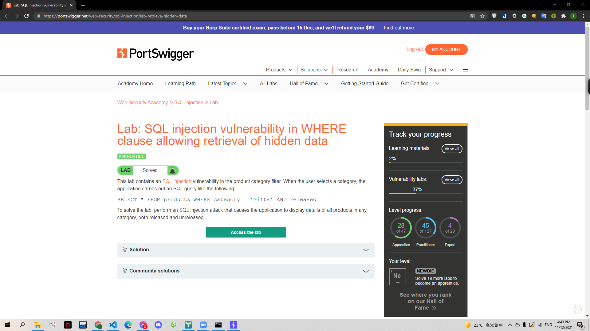
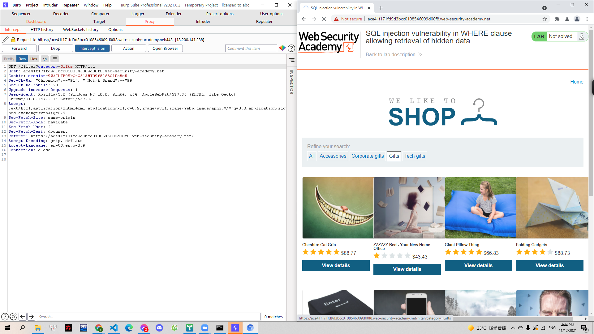
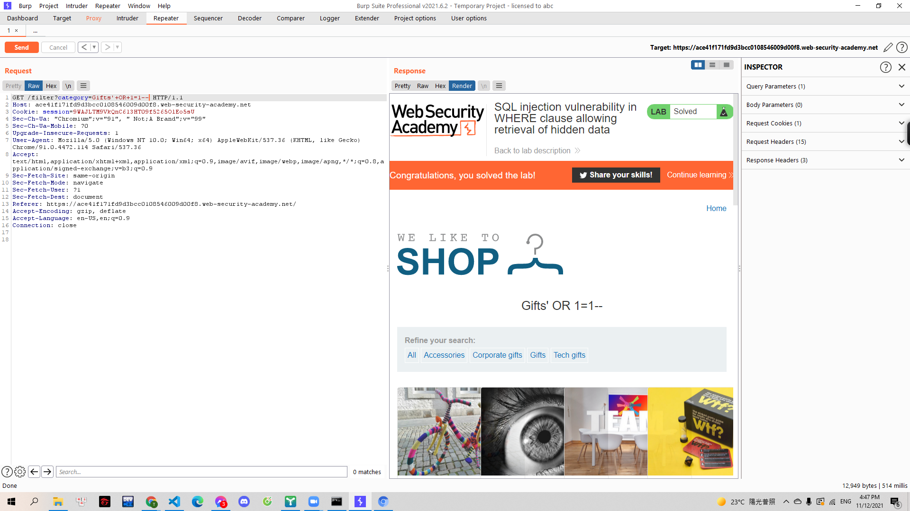

# [Lab: SQL injection vulnerability in WHERE clause allowing retrieval of hidden data](https://portswigger.net/web-security/sql-injection/lab-retrieve-hidden-data)

Yêu cầu:

> 
> Lab này chứa lỗ hổng sqli ở trường product category.Câu lệnh truy vấn sql có dạng `SELECT * FROM products WHERE category = 'Gifts' AND released = 1` Cần khai thác để hiển thị tất cả các sản phẩm khi chọn một trường product bất kì.

---

Trước hết mình bắt request của truy vấn tại 1 trường product bất kì ngoại trừ trường all (Vì trường all luôn hiển thị tất cả sản phẩm)

> 

Do đã xác định được truy vấn xảy ra sqli là ở trường product category nên mình tiến hành kiểm tra sqli bằng câu lệnh trả về kết quả luôn đúng là:

> '+OR+1=1--

Lúc này truy vấn server thực hiện sẽ có dạng `SELECT * FROM products WHERE category = 'Gifts' OR 1=1-- AND released = 1` phần sau -- sẽ được tính là comment. Mà 1=1 luôn đúng nên truy vấn sẽ lấy hết tất cả các iteam có trong `products`

> 
