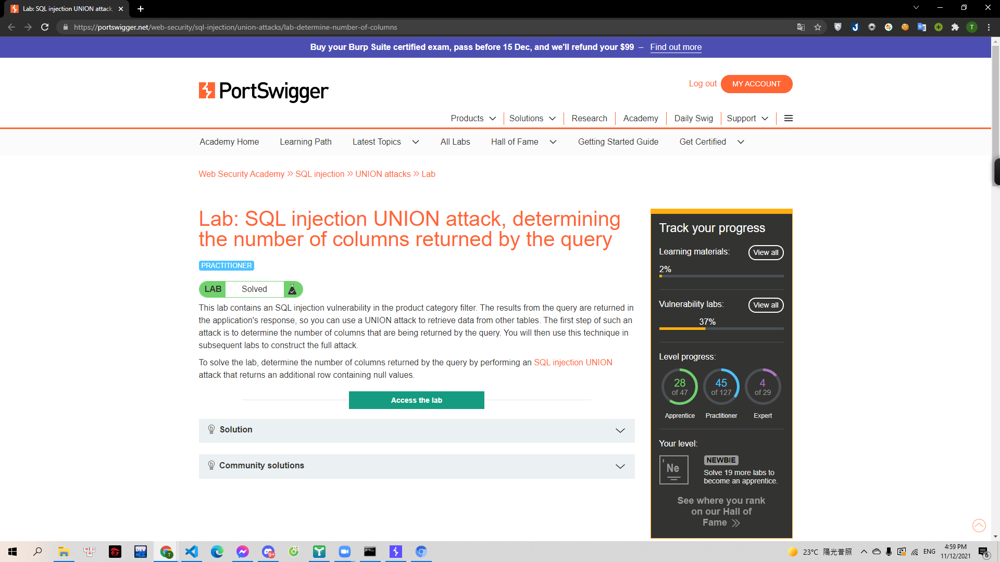
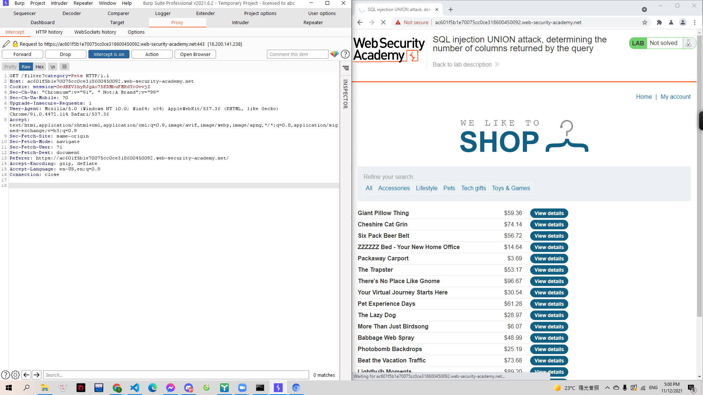
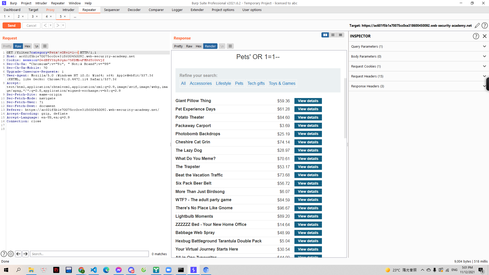
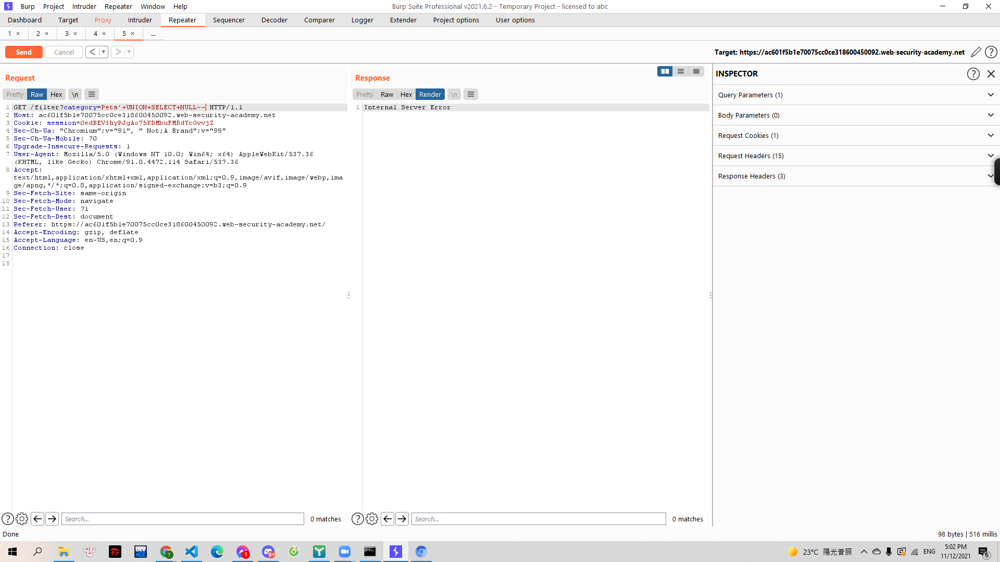
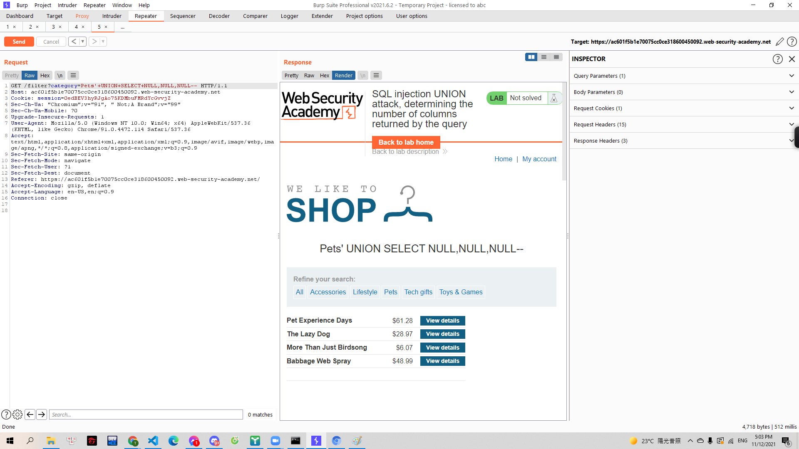
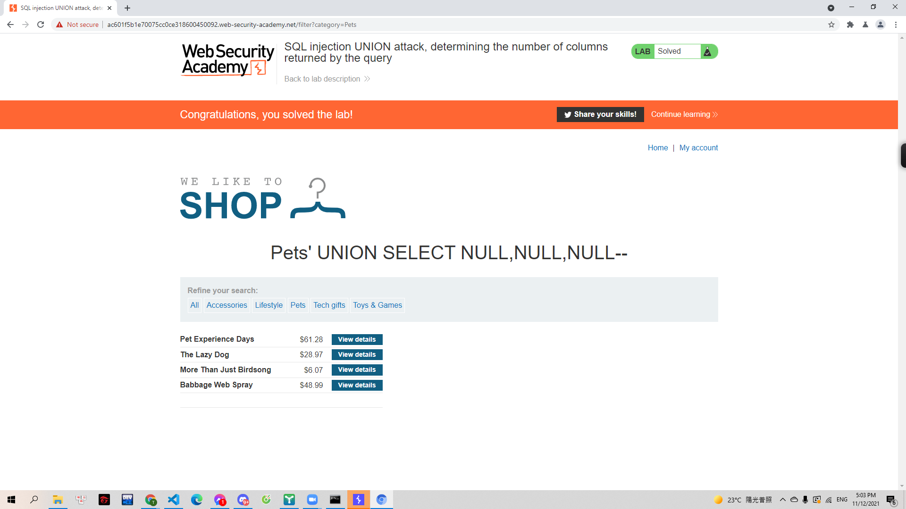

# [Lab: SQL injection UNION attack, determining the number of columns returned by the query](https://portswigger.net/web-security/sql-injection/union-attacks/lab-determine-number-of-columns)

> 
> Yêu cầu: Lab có chứa lỗ hổng sqli ở phần `product category`. Sử dụng UNION để lấy data từ bảng khác. Cần xác định số cột mà SQL query trả về với giá trị NULL

---

Trước tiên mình bắt request khi chọn các sản phẩn thuộc mục `Pets`

> 

Mình sử dụng lệnh UNION để tìm số cột của các tables khác. Lệnh UNION sẽ thực thi thêm 1 hoặc nhiều các lệnh SELECT bổ sung bên cạnh lệnh SQL gốc. Ví dụ:

> SELECT a, b FROM table1 UNION SELECT c, d FROM table2

Câu lệnh sql gốc sẽ trả về column a,b tử table 1. Giờ đây khi kết hợp UNION nó sẽ trả về cả column c,d ở table 2.
Để có thể thực hiện lệnh UNION thì 2 table cần có cùng số column và kiểu dữ liệu các column cần giống nhau. Kiểu dữ liệu `NULL` có thể được chueyenr thành mọi kiểu dữ liệu. Nên sử dụng `NULL` sẽ giúp câu lệnh truy vấn dễ thành công nhất.

Trước hết mình xác định số cột của database bằng truy vấn dạng:

> UNION+SELECT+NULL--

Nếu truy vấn lỗi thì cố column chưa phù hợp và mình sẽ tăng số lượng `NULL` lên:

> 

Truy vấn lỗi:

> 

Khi mình tăng số columns lên 3 thì truy vấn thành công:

> 
> 
