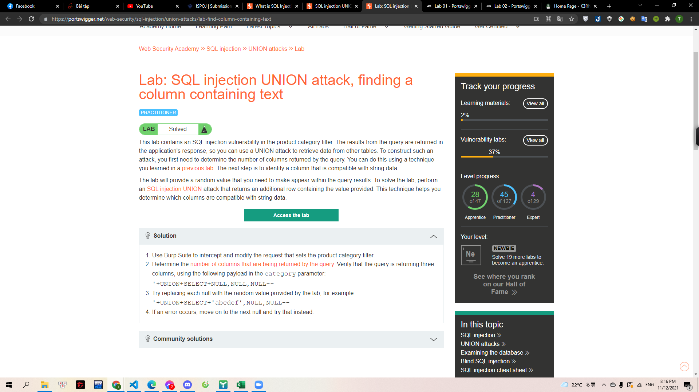
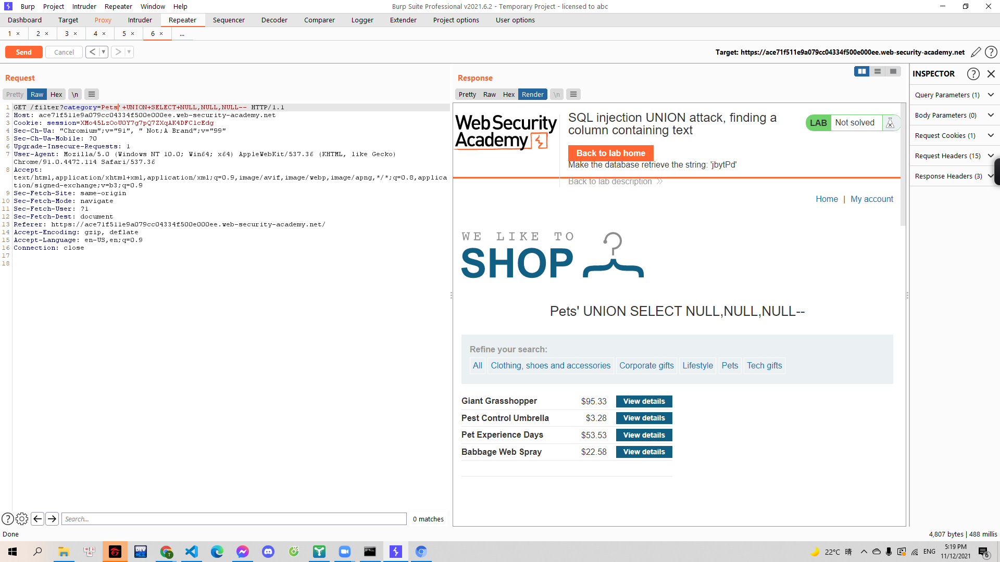
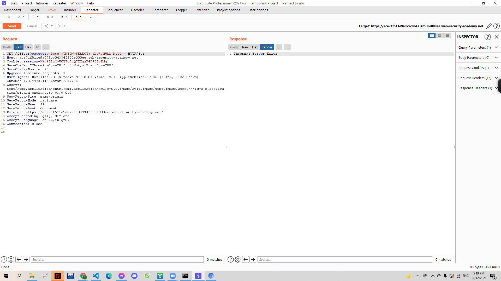
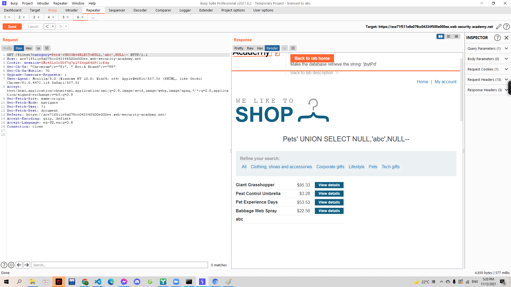
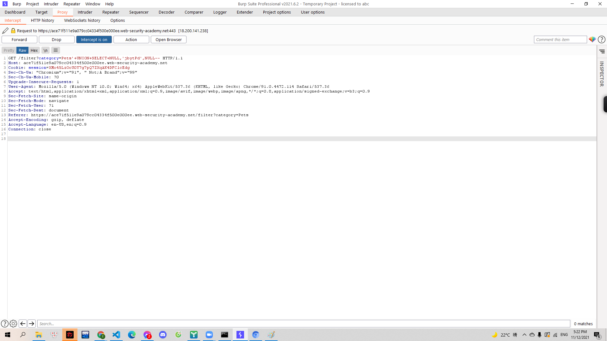

# [Lab: SQL injection UNION attack, finding a column containing text](https://portswigger.net/web-security/sql-injection/union-attacks/lab-find-column-containing-text)

> 
> Yêu cầu: Từ lỗi SQLi tại `product category` tìm số cột. Từ đó thực hiện SQLi UNION để trả về cột mà có giá trị được cho trước.

---

Trước hết mình xử dụng cách làm từ [lab trước](..\Lab3) để tìm ra được số column của table này

> 

Ở đây mình xác định được là table có 3 column. Tiếp theo đó, mình sẽ thay kí tự `NULL` ở query bằng chuỗi `'abc'`. Nếu trả về hợp lệ thì tức nghĩa là kiểu dữ liệu của column đó là chuỗi. Mình thử với vị trí đầu tiên:

> 
> '+UNION+SELECT+'abc',NULL,NULL--

Response trả về lỗi nên mình thay đổi vị trí của chuỗi:

> 

Lúc này trả về đã hợp lệ. Đồng thời mình thấy yêu cầu khôi phục chuỗi `jbytPd`. Nên mình tiến hành sử đổi truy vấn bắt được ban đầu:

> 

Mình forward hết các yêu cầu là có thể giải thành công.
