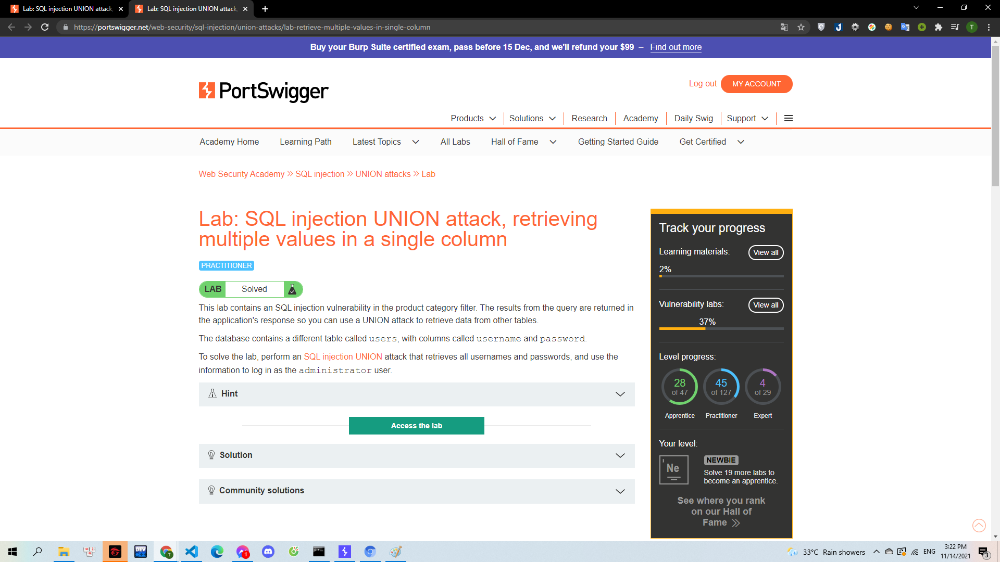

# [Lab: SQL injection UNION attack, retrieving multiple values in a single column](https://portswigger.net/web-security/sql-injection/union-attacks/lab-retrieve-multiple-values-in-single-column)

> 
> Yêu cầu: Từ lỗi SQLi khi chọn danh mục sản phẩm tiến hành truy vấn đến bảng `user` 2 cột `username`,`password` để tìm ra mật khẩu của người dùng `administrator`. Lab này sẽ giúp chúng ta hiển thị cả 2 thông tin này mà chỉ cần truy vẫn trong 1 cột duy nhất.

---

Tương tự như các lab trước. Mình sử dụng UNION SELECT để xác định được số cột của table. Mình xác định được table có 2 cột qua truy vấn `'+UNION+SELECT+NULL,NULL--`:

> 

Mình tiến hành kiếm tra xem đâu là cột chứa dữ liệu dạng chuỗi:

> 

Để có thể thực hiện trả về nhiều giá trị trong 1 cột thì mình cần biết được loại cơ sở dữ liệu được sử dụng. Mình sử dụng [cheat sheet](https://portswigger.net/web-security/sql-injection/cheat-sheet) để dễ dàng tìm kiếm. Sau khi kiểm tra bằng truy vấn `'+UNION+SELECT+NULL,version()--` thì mình xác định được cơ sở dữ liệu được dùng ở đây là `PostgreSQL 11.13`. Cũng thông qua cheat sheet mình tìm được truy vấn để lấy nhiều dữ liệu mà hiển thị trong 1 cột của postSQL: `'+UNION+SELECT+NULL,username||'+'||password+FROM+users--`

> 

Và mình có được tài khoản đăng nhập của `administrator` với mật khẩu là `qcm5hzzxzbd7cwfuuk74`
