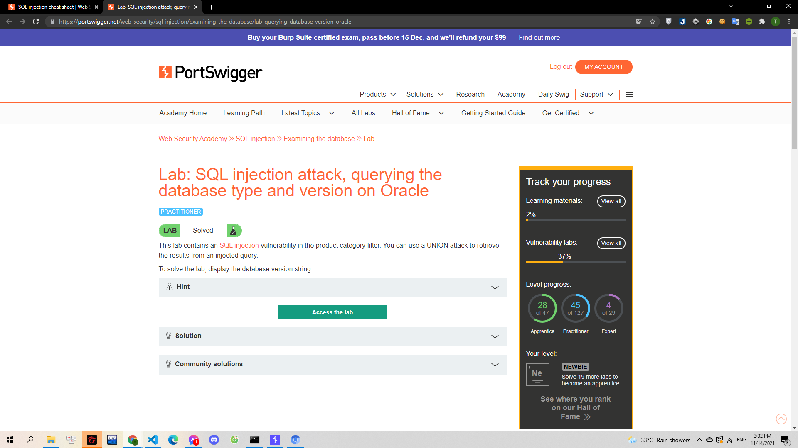
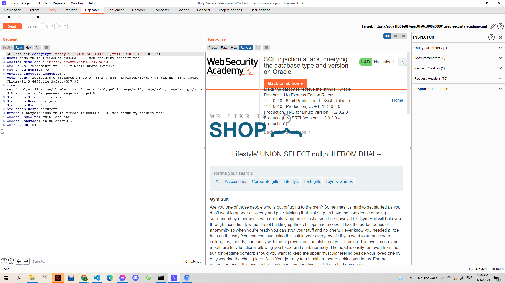
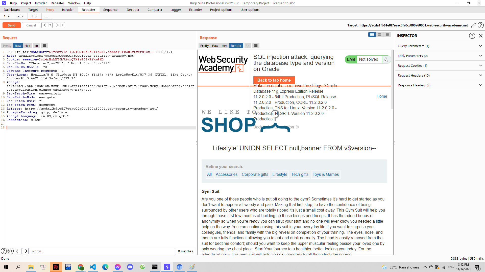

# [Lab: SQL injection attack, querying the database type and version on Oracle](https://portswigger.net/web-security/sql-injection/examining-the-database/lab-querying-database-version-oracle)

> 
> Yêu cầu: Thông qua lỗi SQLi khi truy vấn danh mục sản phẩm. Thực hiện tấn công UNION attack để lấy được phiên bản mà cơ sở dữ liệu đang sử dụng

---

Thông qua tên lab mình biết được là cơ sở dữ liệu sử dụng là Oracle. Ở Oracle có một điều đặc biệt cần lưu ý là mọi truy vấn SELECT đều cần phải có một table nào đó đi kèm. TRong Oracle có table DUAL là một table rỗng được sinh ra tự động, mình sẽ tiến hành truy vấn FROM table này. Mình xác định được số cột qua truy vấn `'+UNION+SELECT+null,null+FROM+DUAL--`

> 

Tiếp theo đó mình sử dụng [cheat sheet](https://portswigger.net/web-security/sql-injection/cheat-sheet) thì viết được dạng câu lệnh truy vấn version, thử lần lượt với các vị trí NULL bằng cú pháp `banner FROM v$version`. Mình có truy vấn hoàn chỉnh: `'+UNION+SELECT+null,banner FROM v$version--`

> 
