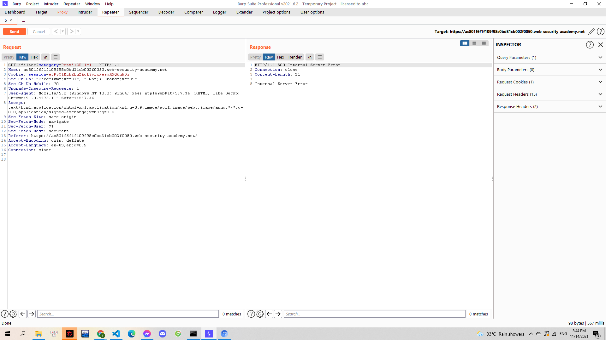

# [Lab: SQL injection attack, querying the database type and version on MySQL and Microsoft](https://portswigger.net/web-security/sql-injection/examining-the-database/lab-querying-database-version-mysql-microsoft)

> 
> Yêu cầu: Từ lỗ hổng SQLi khi truy vấn đến danh mục sản phẩn. Hãy sử dụng dạng tấn công UNION để đưa ra phiên bản của sơ sở dữ liệu.

---

Trước tiên mình test với lệnh kiểm tra thông thường `'+OR+1=1--` thì kết quả trả về không hợp lệ:

> 

Lúc này mình mới để ý yêu cầu là truy vẫn từ cơ sở dự liệu MySQL. Dựa theo [cheat sheet](https://portswigger.net/web-security/sql-injection/cheat-sheet) mình thử đến truy vấn `'+OR+1=1#`

> 

Mình sử dụng cách tìm số cột thông qua SELECT. Và mình xác định được số cột trong bảng là 2 qua truy vấn `'+UNION+SELECT+NULL,NULL#`. Mình kiểm tra xem cột nào trong bảng chứa data string qua truy vấn `'+UNION+SELECT+'a','b'#`

> 

Sử dụng [cheat sheet](https://portswigger.net/web-security/sql-injection/cheat-sheet) mình tìm được câu lệnh phù hợp để lấy version của MySQL là `'+UNION+SELECT+@@version,+NULL#`

