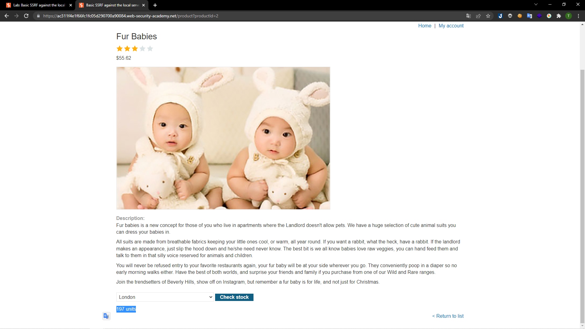
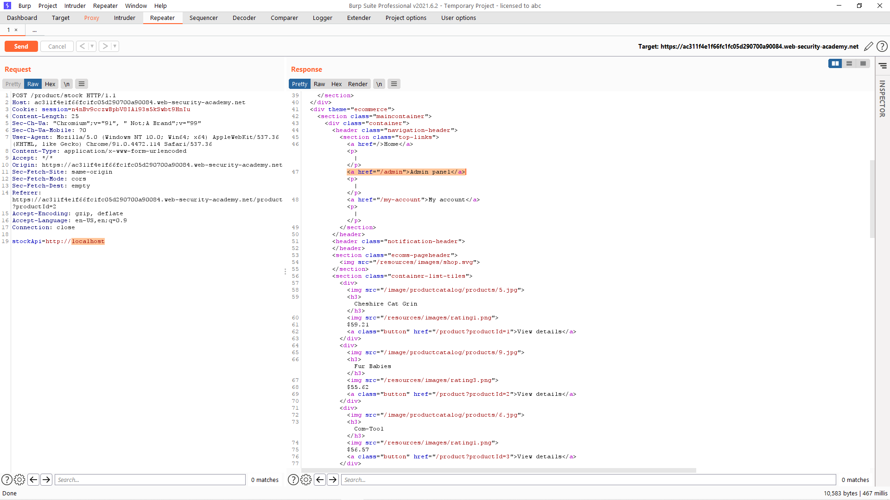

# [Lab: Basic SSRF against the local server](https://portswigger.net/web-security/ssrf/lab-basic-ssrf-against-localhost)

## Yêu cầu:

Lab này có tính năng kiểm tra kho, lấy dữ liệu từ hệ thống nội bộ. Hãy đổi URL của việc kiểm tra kho thành `http://localhost/admin` và xóa tài khoản `carlos`

---

Trước hết mình sẽ tìm đến một mặt hàng và kiểm tra tính năng check stock:

Mình sử dụng BurpSuite để bắt request này, thì thấy được API sử dụng để kiểm tra sản phẩm có gọi URL từ một nguồn khác:

Thay đổi nguồn này thành địa chỉ `localhost` để xem cấu hình đầy đủ của trang web, và mình tìm được url của `Admin penel` là `/admin`:

Thay đổi tiếp giá trị của `stockAPI` để vào được trang của admin, tại đây mình tìm được URL để xóa tài khoản `carlos`:

Tiếp tục thay đổi giá trị của stockAPI, sau đó gửi đi request này:

Tắt intercept là có thể hoàn thành lab:

