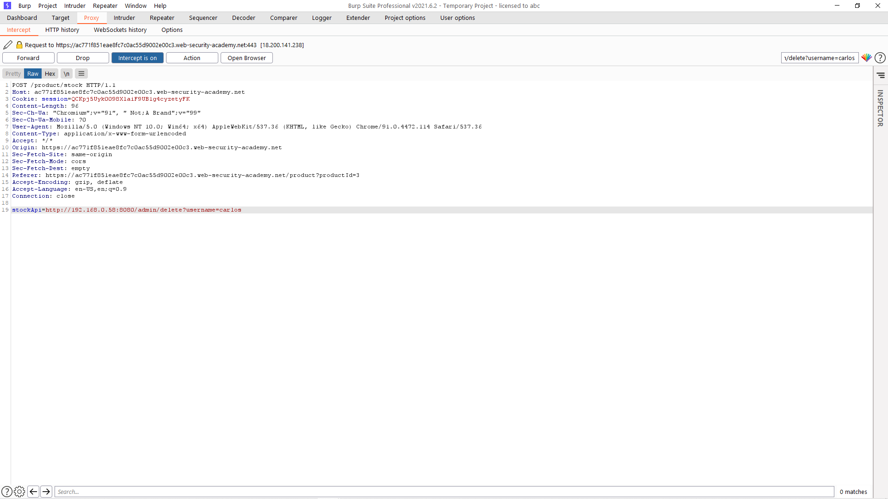

# [Lab: Basic SSRF against another back-end system](https://portswigger.net/web-security/ssrf/lab-basic-ssrf-against-backend-system)

## Yêu cầu:

Lab này có tính năng kiểm tra số lượng sản phẩm gọi API từ server. Tìm server nội bộ `192.168.0.X:8080` để zoá người dùng `carrlos`

---

Sau khi tìm được tính năng kiểm tra sản phẩm `Check stock` thì mình bắt request của tính năng này bằng BurpSuite:

Mình làm theo hướng dẫn của lab, tìm giá trị chính xác của server nội bộ bằng cách brute bằng tính năng Intruder:

Mình chỉnh các thông số như sau:

Sau khi brute mình lọc các status code, mình nhận được status code 404, có lẽ là do sai URL:

Ở [Lab1](../Lab1) thì URL của trang quản lý `admin` là `\admin` nên mình sửa lại sau đó brute:

Sau đó mình tìm được status code 200, và check source code thì tìm được URL để xóa tài khoản `carlos`

Thay vào request bắt được ban đầu sau đó forward request:

Sau khi forward thì mình hoàn thành được lab:

