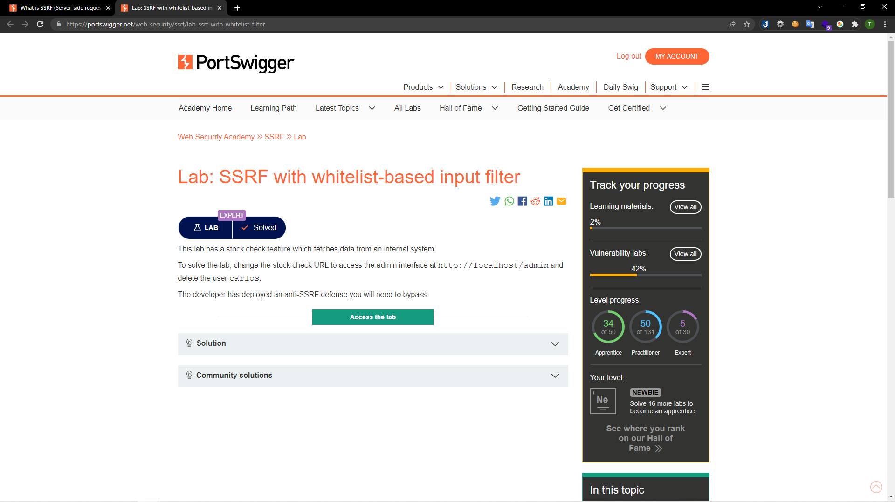
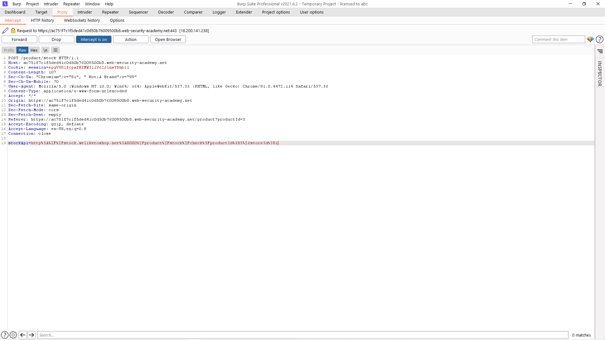
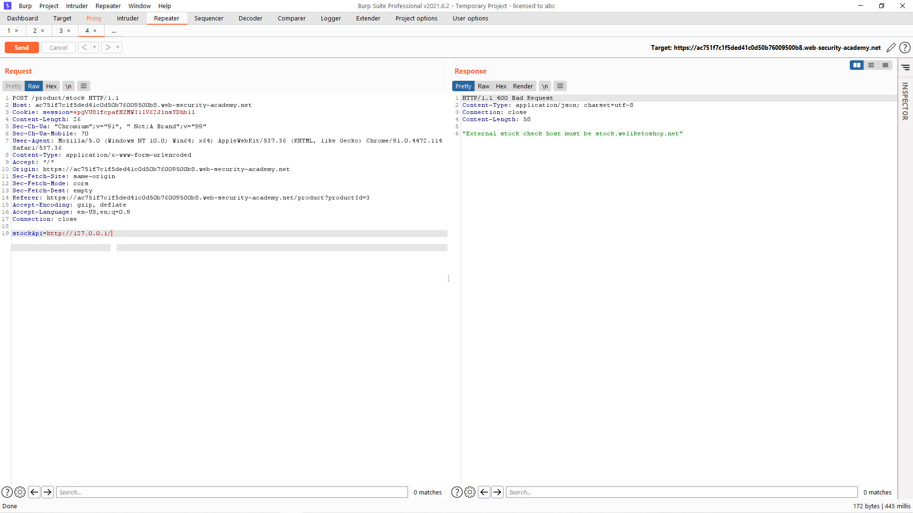
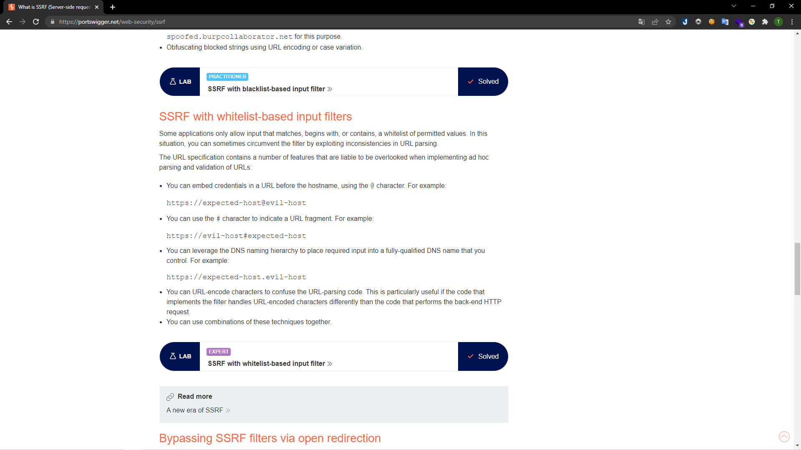
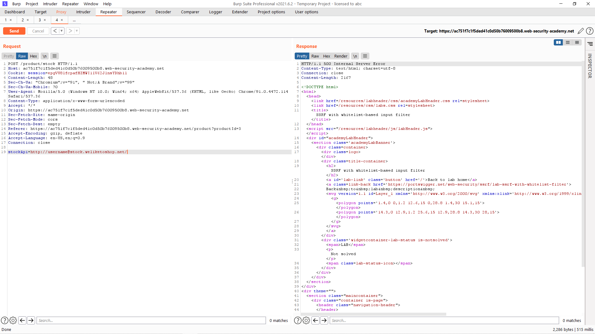
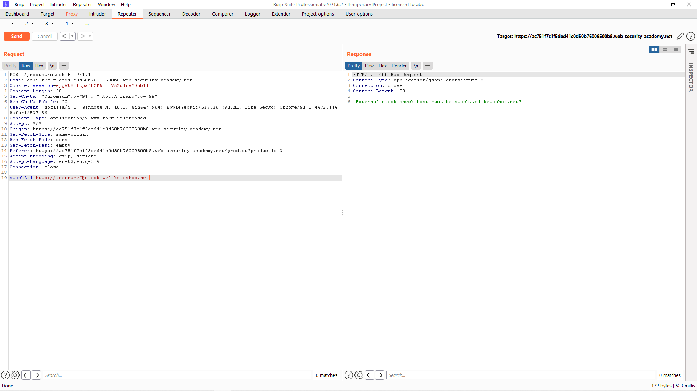
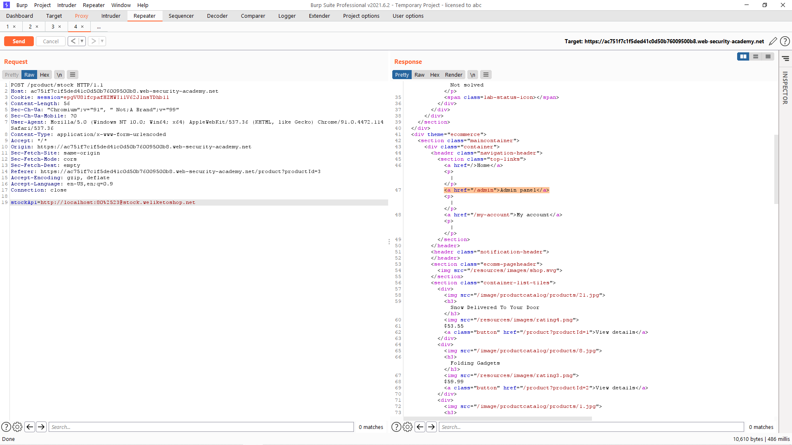
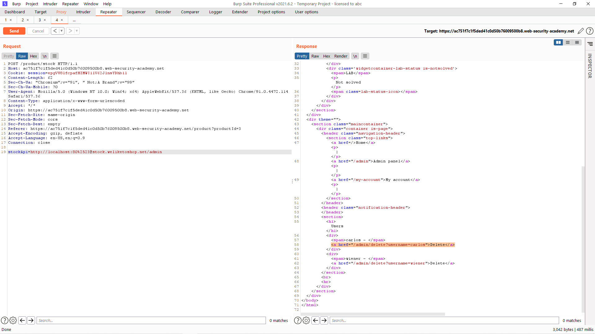
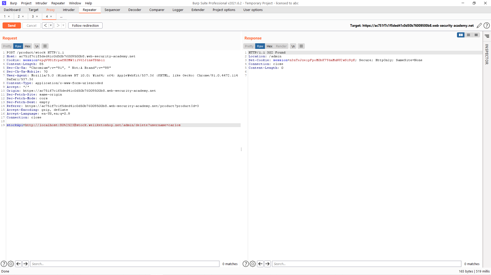
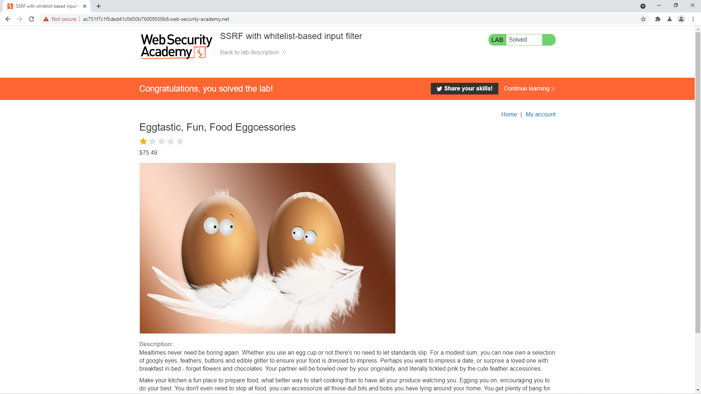

# [Lab: SSRF with whitelist-based input filter](https://portswigger.net/web-security/ssrf/lab-ssrf-with-whitelist-filter)

## Yêu cầu:

Thông qua tính năng kiểm tra sản phẩm, truy cập vào ` http://localhost/admin` để xóa người dùng `carlos`. Cần phải bypass 2 lớp bảo mật yếu.

---

Giống như các lab trước, mình tiếp tục bắt request khi kiểm tra sản phẩm bằng BurpSuite:

Sau đó thử đổi giá trị của stockAPI thành IP của localhost tuy nhiên nhận được yêu cầu rằng cần phảo lấy data từ `stock.weliketoshop.net`:

Lúc này mình sử dụng cách làm ở phần mô tả cách khai thác để test thử:

Thử với tài khoản `username`, lúc này webhost vẫn đảm bảo tuy nhiên dữ liệu lại không có:

Sau đó mình thêm # thì webhost đã thay đổi sang `username`:

Sau khi encode URL # 2 lần thì webhost lại thỏa mãn, nên mình đã thay giá trị của `username` thành `localhost:80` và mình tìm được URL của `Admin panel`:

Bổ sung vào giá trị của stockAPI để tìm URL xóa người dùng `carlos`:

Sau khi có được URL cần tìm thì mình tiếp tục bổ sung vào stockAPI:

Vậy là hoàn thành được lab:

