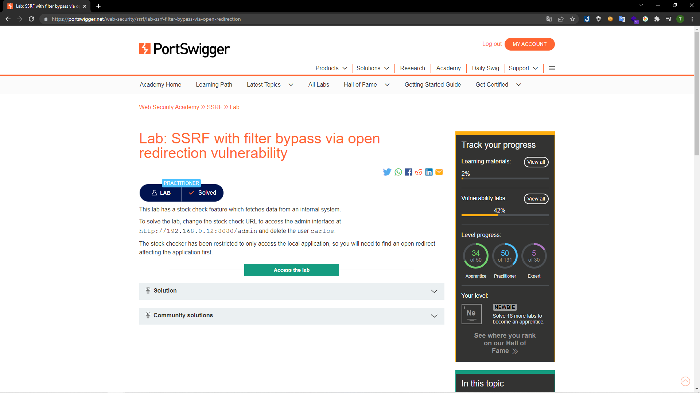
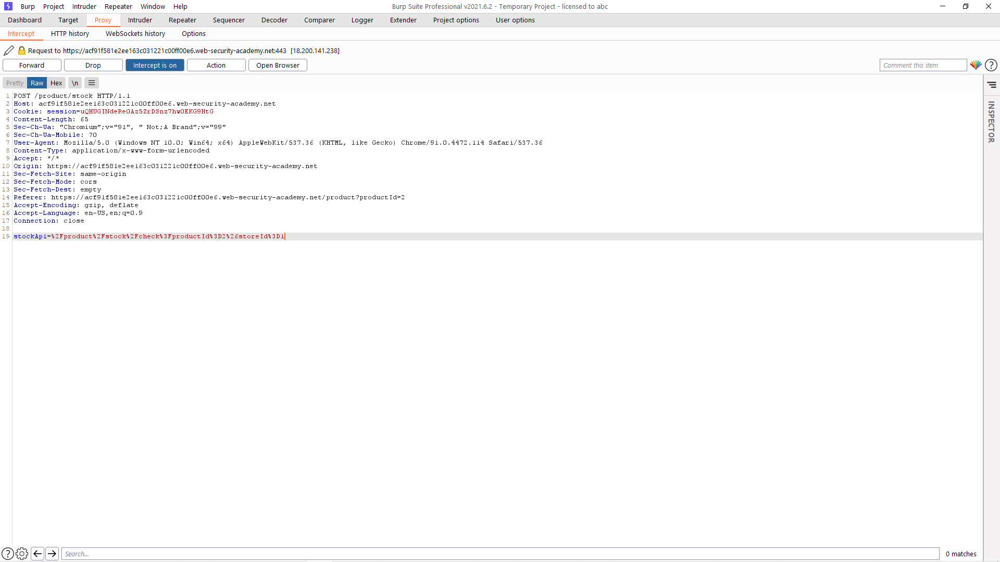
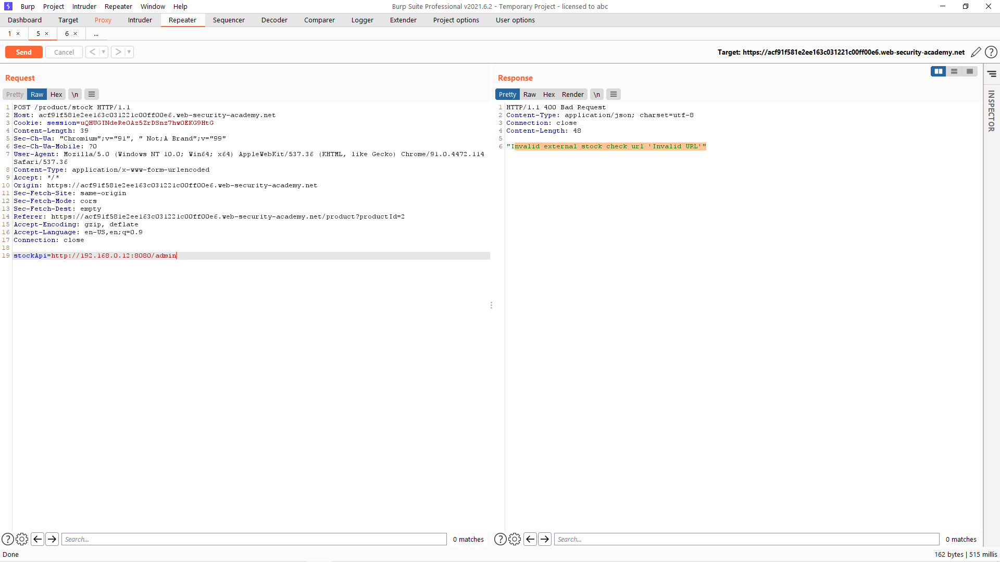
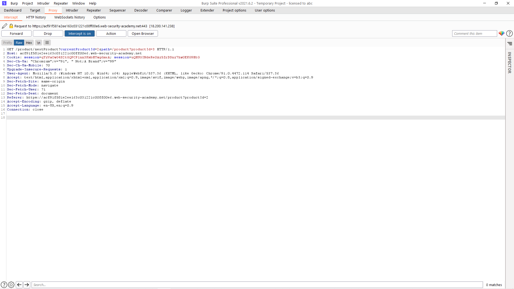
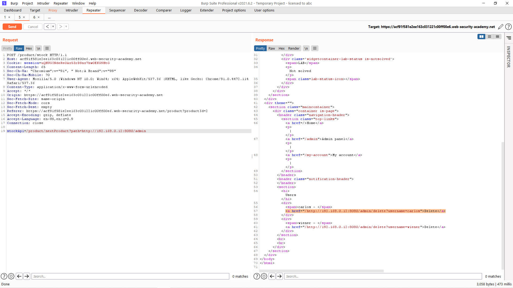
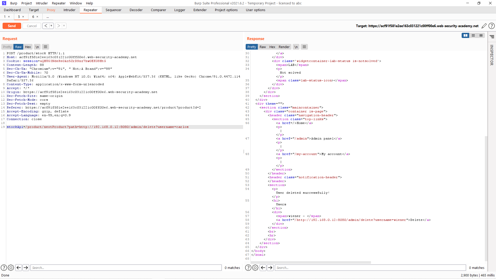
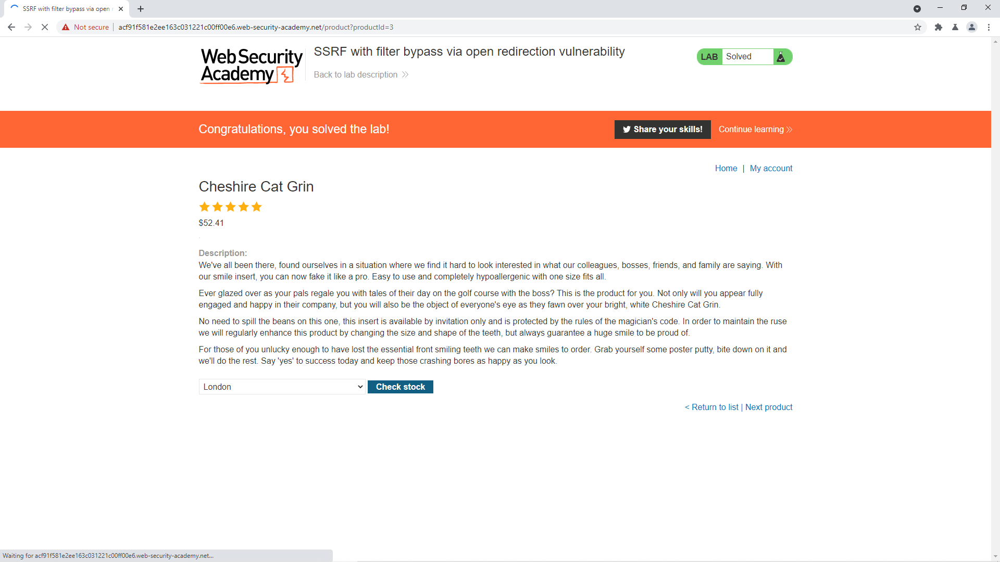

# [Lab: SSRF with filter bypass via open redirection vulnerability](https://portswigger.net/web-security/ssrf/lab-ssrf-filter-bypass-via-open-redirection)

## Yêu cầu:

Từ tính năng kiểm tra sản phẩm. Truy cập vào giao diện admin tại `http://192.168.0.12:8080/admin` để xóa người dùng carlos
Việc kiểm tra sản phẩm chỉ có thể kiểm tra tại ứng dụng local. Cần tìm tìm ra mã nguồn chuyển hướng mở ảnh hướng tới ứng dụng.

---

Trước hết mình bắt request kiểm tra sản phẩm bằng BurpSuite:

Sau đó thử thay đổi giá trị của stockAPI thành giá trị của giao diện admin thì nhận được thông báo lỗi:

Việc bây giờ cần làm là tìm ra được mã nguồn chuyển hướng ảnh hưởng tới ứng dụng. Mình thấy lab này có tính năng `Next product` mà các lab trước không có nên mình đã bắt thử request và tìm thấy tính năng này có sử dụng việc gọi URL tại param path:

Mặc dù stock API đã chặn SSRF nhưng param path lại không làm điều đó. Nên mình đã thay đổi stockAPI bằng yêu cầu để tải sản phẩm tiếp theo, đồng thời thay đổi giá trị của param path:

Sau khi tìm được URL để xóa tài khoản mình chỉ cần bổ sung vào giá trị của stockAPI

Và thế là mình hoàn thành được lab:

